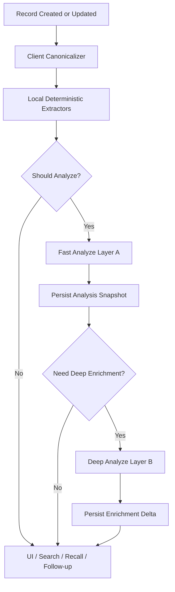

# Mory AI 记录分析架构文档 v1.0

> 基于当前仓库现状与目标产品形态设计  
> 更新时间：2026-05-13  
> 适用范围：单条记录 AI 分析、记录级结构化输出、前后端 AI 协议、分析持久化与触发机制

## 1. 文档目标

这份文档专门回答一个核心问题：

> Mory 中“每一条记录”到底应该如何被 AI 分析？

这里的重点不是做一个泛泛的聊天助手，而是设计一条**面向记录对象本身**的分析链路。  
AI 的职责不是代替用户写日记，而是把一条记录从“原始输入”转化为“可索引、可回看、可连接、可追问”的结构化记忆单元。

本文档将覆盖：

- 单条记录分析的业务目标
- 每条记录的真实输入面应该是什么
- 输出应该落成什么结构，而不只是几句文案
- 整个分析链路如何拆层
- 哪些结果应写回本地模型，哪些只作为临时推断
- 前后端 API 应如何重构
- 当前代码现状与目标架构之间的缺口

## 2. 当前现状与核心问题

### 2.1 当前代码里的 AI 分析现状

当前后端 `AnalyzeRequest` 只包含两类输入：

- `record.content`
- `persons[]`

当前后端 `AnalyzeResponse` 输出：

- `tags`
- `emotion`
- `persons`
- `new_media`
- `insight`
- `follow_up`

当前实现位置：

- 请求/响应模型：`server/internal/ai/types.go`
- Prompt：`server/internal/ai/prompt.go`
- 解析：`server/internal/ai/parse.go`
- Provider：`server/internal/ai/anthropic.go`、`server/internal/ai/openai.go`
- 接口：`POST /api/records/analyze`

### 2.2 当前设计为什么不够

这套协议对“文本试跑”够用，但对真实产品不够，原因很直接：

- 你的记录不是纯文本，而是多模态对象
- `Record` 实际已经包含地点、天气、情绪、人物、媒体、todo、音频、音乐等上下文
- 当前分析输入没有把这些上下文送给模型
- 当前输出也没有定义“哪些结果是最终可落库的结构化资产”
- App 端目前没有完整的“正式记录分析 -> 本地持久化 -> UI 消费”闭环

所以现在的 AI 更像一个 demo analyze endpoint，而不是“记录级 AI 系统”。

### 2.3 真实产品目标

对 Mory 来说，AI 分析的目标不应该是“生成一句 insight”这么浅。  
它真正要做的是：

1. 看懂这一条记录到底记录了什么
2. 知道这条记录和谁、什么地点、什么情绪、什么事件有关
3. 判断这条记录值不值得追问、归档、提醒、连接
4. 产出后续可用于检索、回顾、推荐、人物关系、每日问题的结构化结果

## 3. 设计原则

### 3.1 记录是对象，不是消息

Mory 的 AI 输入单位应该是 `Record Aggregate`，不是“用户刚说的一段话”。

也就是说，AI 分析对象必须包含：

- 文本
- 时间
- 附件
- 人物
- 情绪
- 地点
- 天气
- 活动
- 任务
- 外链/音乐

### 3.2 用户手填内容优先于 AI 推断

如果用户已经明确填写了：

- `mood`
- `intensity`
- `location`
- `weather`
- `mentionedPeople`

AI 不应覆盖这些字段，只能：

- 补充解释
- 补充结构
- 做置信推断
- 做弱建议

### 3.3 AI 输出必须结构化

真正可用的输出不是一段 prose，而是可落库的 structured result。

文本型输出只应作为其中一部分：

- `summary`
- `insight`
- `follow_up`

更重要的是：

- `event_type`
- `themes`
- `emotion`
- `person_resolution`
- `memory_salience`
- `retrieval_keywords`
- `media_enrichment_tasks`
- `question_candidates`

### 3.4 记录分析要分层，不能一把梭

单条记录分析最好拆成两层：

- `Layer A: 快速结构化分析`
- `Layer B: 可选深度反思/补全`

原因：

- 大多数记录不值得跑重分析
- 多模态记录的耗时和 token 成本差异很大
- 首页和写入链路需要快
- 深度追问、人物关系、长期记忆连接可以异步

### 3.5 不直接把原始二进制媒体塞给当前分析接口

当前仓库没有成熟的图片/音频上传与 vision pipeline。  
因此记录级分析的合理做法是：

- 先把媒体转成“文本化摘要”
- 再把文本化摘要送给统一分析器

例如：

- 照片：`aiDescription` / caption / location / capturedAt
- 音频：ASR transcript / 时长 / capturedAt
- 音乐：track / artist / album / Apple Music URL
- todo：标题 + 条目列表

## 4. 什么叫“每一条记录的 AI 分析”

### 4.1 定义

单条记录 AI 分析是指：

> 针对一个 `Record` 聚合对象，在给定有限上下文的前提下，输出一份稳定、可持久化、可复用的分析快照 `RecordAnalysisSnapshot`。

### 4.2 分析目标拆解

每条记录至少应回答 8 个问题：

1. 这条记录的主事件是什么？
2. 这条记录涉及哪些主题？
3. 这条记录反映了什么情绪？
4. 这条记录涉及哪些人？是已知人物还是新人物？
5. 这条记录里有没有可扩充的媒体对象？
6. 这条记录未来检索时应靠哪些关键词被找回？
7. 这条记录是否值得追问？
8. 这条记录在用户长期记忆中重要性多高？

### 4.3 不应让单条分析承担的事情

单条记录分析不应该直接承担：

- 全库长期记忆检索
- 多轮对话式咨询
- 用户人生画像总结合成
- 大规模知识库问答

这些属于上层能力。  
单条记录分析只负责把每条记录变成高质量的语义砖块。

## 5. 记录级输入设计

## 5.1 当前真实输入源

从当前 `Record` 和关联模型看，一条记录可用输入包括：

- `Record.body`
- `Record.createdAt`
- `Record.updatedAt`
- `Record.tags`
- `Record.cardType`
- `Record.mood`
- `Record.intensity`
- `Record.location`
- `Record.latitude`
- `Record.longitude`
- `Record.weather`
- `Record.temperature`
- `Record.feelsLike`
- `Record.humidity`
- `Record.weatherHigh`
- `Record.weatherLow`
- `Record.weatherObservedAt`
- `Record.weatherSource`
- `Record.mentionedPeople`
- `Record.activity`
- `Record.dailyQuestion`
- `Record.linkedDecisions`
- `Record.mediaCards`

其中 `mediaCards` 又可能包含：

- `photo`
- `music`
- `audio`
- `link`
- `todo`

### 5.2 建议的统一输入协议

当前 `AnalyzeRequest` 过窄，建议升级为面向记录聚合的协议。

```json
{
  "schema_version": "record_analysis.v1",
  "analysis_reason": "create|edit|replay|manual|background",
  "user": {
    "user_id": "string",
    "tier": "seed|grow|preview",
    "locale": "zh-CN",
    "timezone": "Asia/Shanghai"
  },
  "record": {
    "id": "uuid",
    "created_at": "2026-05-13T09:20:00Z",
    "updated_at": "2026-05-13T09:20:00Z",
    "card_type": "photo",
    "body": "今天和阿杰在静安寺附近喝咖啡，聊了辞职的事。",
    "user_tags": ["career", "friend"],
    "emotion": {
      "user_label": "anxious",
      "user_intensity": 4
    },
    "location": {
      "name": "静安寺",
      "latitude": 31.223,
      "longitude": 121.445
    },
    "weather": {
      "condition": "cloudy",
      "temperature_c": 26,
      "feels_like_c": 28,
      "humidity": 78,
      "observed_at": "2026-05-13T09:18:00Z",
      "source": "current_location_auto"
    },
    "people": [
      {
        "id": "person-1",
        "name": "阿杰",
        "nickname": "杰",
        "relationship": "friend",
        "last_mentioned_at": "2026-05-01T12:00:00Z",
        "mention_count": 6
      }
    ],
    "activity": {
      "type": "custom",
      "name": "Coffee chat",
      "value": null,
      "unit": null,
      "duration_minutes": 90,
      "note": "Discussed quitting job"
    },
    "daily_question": {
      "question_text": "最近什么事情最让你纠结？",
      "answer_text": null
    },
    "linked_decisions": [
      {
        "id": "decision-1",
        "title": "是否在六月离职",
        "status": "pending"
      }
    ],
    "media": {
      "photos": [
        {
          "sort_index": 0,
          "caption": "",
          "ai_description": "Indoor cafe table with two cups and notebook",
          "captured_at": "2026-05-13T09:12:00Z",
          "location_name": "静安寺"
        }
      ],
      "audio": [],
      "music": [],
      "links": [],
      "todos": []
    }
  },
  "context": {
    "recent_record_summaries": [],
    "person_memory_summaries": [],
    "decision_context_summaries": []
  }
}
```

### 5.3 输入应分三层

#### 第一层：记录原始事实

这是必须输入：

- 文本正文
- 创建时间
- 用户显式填写的情绪/天气/地点
- 人物列表
- 媒体基础元数据

#### 第二层：记录文本化摘要

这是推荐输入：

- 图片描述
- 音频转写
- todo 展平文本
- music / link 标题摘要

#### 第三层：有限上下文

这是可选输入：

- 最近 3 到 5 条记录摘要
- 当前人物的历史摘要
- 当前 decision 的历史摘要

注意这里要控制在“有限上下文”，不要把全库内容一股脑塞进模型。

### 5.4 不同记录类型的最低输入要求

| 记录类型 | 最低输入 | 推荐附加输入 | 不建议缺失 |
| --- | --- | --- | --- |
| `text` | body, created_at | people, tags, previous summaries | body 为空 |
| `emotion` | mood, intensity, body | created_at, related people | 只有 mood 无时间 |
| `weather` | weather snapshot | location, body | 缺 observed_at |
| `map` | location/coordinate | body, people | 只有经纬度无名称和正文 |
| `photo` | ai_description 或 caption | location, captured_at, body | 原图直传但无摘要 |
| `music` | title, artist | album, body, timestamp | 只有 URL 无标题 |
| `audio` | transcript/caption | duration, captured_at | 只有音频二进制无文本 |
| `todo` | title + items | body, due intent | caption 未结构化 |
| `people` | people list | body, relationship history | 只有名字列表无上下文 |

## 6. 分析流水线设计

### 6.1 总体流水线



### 6.2 Client Canonicalizer

客户端先做一层确定性归一化，而不是直接把原始 `Record` 扔给后端。

职责：

- 从 `Record + 关联对象` 组装统一 JSON
- 展平 todo / music / links / audio transcript
- 将本地已有 `Person` 结构打包
- 给照片、音频附带文本化摘要
- 计算 `content_hash`
- 决定分析原因 `analysis_reason`

建议新增概念：

- `RecordCanonicalPayload`

这应该是**请求 DTO**，不是持久化模型。

### 6.3 Layer A：快速结构化分析

Layer A 是所有记录默认都应支持的分析层。

目标：

- 低延迟
- 稳定 JSON
- 不依赖大上下文
- 足以支持首页、详情页、检索、标签、基础 follow-up

Layer A 输出建议包括：

- `event_type`
- `themes`
- `emotion`
- `person_resolution`
- `media_hints`
- `short_summary`
- `retrieval_keywords`
- `follow_up_candidate`
- `salience_score`

建议目标耗时：

- `P50 < 2.5s`
- `P95 < 6s`

### 6.4 Layer B：深度反思与补全

Layer B 只对部分记录触发，例如：

- 文本很长
- 人物关系密度高
- 有 decision 关联
- 有值得追问的情绪冲突
- 有高 salience 的人生节点

Layer B 负责：

- 更深层 insight
- 候选每日问题
- 与历史人物/决策关系的连接建议
- 可用于“未来回看”的 memory hooks
- 更高级的媒体 enrichment suggestions

Layer B 可以异步运行，不阻塞主写入链路。

### 6.5 Should Analyze 规则

不是每条记录都值得重跑重分析。  
建议策略：

- 创建新记录时：默认跑 Layer A
- 仅编辑布局或卡片尺寸时：不重跑
- 仅编辑非语义字段时：不重跑
- 正文/人物/地点/情绪/媒体摘要变化时：重跑
- 模型版本升级时：允许后台 reanalyze

建议通过以下字段判断：

- `input_hash`
- `analysis_schema_version`
- `model_family`

## 7. 输出设计

### 7.1 输出分层

输出不应只有一个大 JSON。建议逻辑上分四层：

- `semantic`
- `relational`
- `reflective`
- `operational`

### 7.2 语义层输出 semantic

这层回答“这条记录是什么”。

建议字段：

- `event_type`
- `themes`
- `short_summary`
- `timeline_title`
- `retrieval_keywords`
- `language`
- `content_density`
- `salience_score`

示例：

```json
{
  "event_type": "career_reflection",
  "themes": ["career", "friendship", "uncertainty", "courage"],
  "short_summary": "和朋友在咖啡馆讨论是否辞职，情绪焦虑但也有期待。",
  "timeline_title": "和阿杰聊辞职",
  "retrieval_keywords": ["辞职", "阿杰", "静安寺", "咖啡", "职业选择"],
  "language": "zh-CN",
  "content_density": "medium",
  "salience_score": 0.83
}
```

### 7.3 关系层输出 relational

这层回答“这条记录和谁/什么已有对象相关”。

建议字段：

- `person_resolutions[]`
- `decision_links[]`
- `location_semantics`
- `related_memory_candidates[]`

其中 `person_resolutions[]` 建议结构：

```json
[
  {
    "name": "阿杰",
    "action": "link",
    "person_id": "person-1",
    "role_in_record": "conversation_partner",
    "confidence": 0.96
  }
]
```

### 7.4 反思层输出 reflective

这层回答“这条记录值不值得想一想，以及该怎么追问”。

建议字段：

- `emotion`
- `insight`
- `follow_up_candidate`
- `question_candidates[]`
- `reflection_mode`

其中：

- `emotion` 用来表示 AI 推断，不覆盖用户显式情绪
- `insight` 是当前记录的高度概括
- `follow_up_candidate` 是最近一步追问
- `question_candidates[]` 可用于未来 `DailyQuestion`

### 7.5 运营层输出 operational

这层回答“系统接下来怎么处理这条记录”。

建议字段：

- `should_notify`
- `should_revisit`
- `revisit_after_days`
- `media_enrichment_tasks[]`
- `analysis_warnings[]`

例如：

- 这条记录适合 7 天后回看
- 这条照片值得做 vision caption
- 这条音频需要 ASR 才能继续深分析

## 8. 建议的统一响应协议

### 8.1 新响应示例

```json
{
  "analysis_id": "ra_123",
  "schema_version": "record_analysis.v1",
  "record_id": "uuid",
  "status": "completed",
  "semantic": {
    "event_type": "career_reflection",
    "themes": ["career", "friendship", "uncertainty"],
    "short_summary": "和朋友聊辞职决定，感到焦虑但逐渐清晰。",
    "timeline_title": "聊辞职的咖啡时刻",
    "retrieval_keywords": ["辞职", "阿杰", "静安寺", "咖啡"],
    "salience_score": 0.83
  },
  "relational": {
    "person_resolutions": [
      {
        "name": "阿杰",
        "action": "link",
        "person_id": "person-1",
        "role_in_record": "conversation_partner",
        "confidence": 0.96
      }
    ],
    "decision_links": [
      {
        "decision_id": "decision-1",
        "relation": "supports_consideration",
        "confidence": 0.88
      }
    ]
  },
  "reflective": {
    "emotion": {
      "label": "anxious_hopeful",
      "intensity": 4,
      "confidence": 0.84
    },
    "insight": "这条记录的关键不是辞职本身，而是你第一次认真把它说出口。",
    "follow_up_candidate": {
      "question": "如果不考虑风险，你真正想离开的原因是什么？",
      "expires_at": "2026-05-14T09:00:00Z"
    },
    "question_candidates": [
      "你现在最害怕失去的是什么？",
      "这个决定最想证明什么？"
    ]
  },
  "operational": {
    "should_revisit": true,
    "revisit_after_days": 7,
    "media_enrichment_tasks": [],
    "analysis_warnings": []
  },
  "meta": {
    "provider": "anthropic",
    "model": "claude-xxx",
    "input_tokens": 1850,
    "output_tokens": 420,
    "input_hash": "sha256:...",
    "analyzed_at": "2026-05-13T09:25:00Z"
  }
}
```

### 8.2 为什么要扩成这套结构

因为这套结构可以直接支持：

- 首页摘要
- 详情页 insight
- 搜索召回
- 人物关系增强
- 决策记录连接
- 每日问题生成
- 未来 revisit 提醒

而不需要每个功能都重新问一次模型。

## 9. 单条记录的类型化分析策略

### 9.1 文本记录

输入重点：

- `body`
- `people`
- `created_at`
- `user_tags`
- `emotion.user_*`

输出重点：

- 主题
- 事件类型
- 情绪推断
- 人物解析
- 追问

### 9.2 情绪记录

输入重点：

- 用户已选 `mood`
- `intensity`
- 附加 note

策略：

- 把用户显式情绪当作 ground truth
- AI 只负责解释“为什么会这样”
- 不要覆盖 `mood`

输出重点：

- 情绪语义化摘要
- 触发因素
- 追问问题
- 是否需要 revisit

### 9.3 天气记录

纯天气记录通常语义密度低。  
如果 `body` 为空，不值得跑重分析。

建议：

- 只有天气卡且无正文时：只做轻量分类
- 有天气 + 文本时：把天气当上下文，不作为主事件

### 9.4 地图 / 地点记录

地点型记录的核心不是经纬度，而是“这个地方对这条记忆意味着什么”。

输入重点：

- `location.name`
- `coordinate`
- `body`
- `people`

输出重点：

- 地点语义
- 是否为 recurring place
- 可检索关键词

### 9.5 照片记录

照片记录不能只靠原图。  
推荐输入为：

- `ai_description`
- 用户 caption
- `captured_at`
- `location_name`
- record body

建议策略：

- 没有任何文本化摘要时，不跑重分析
- 有 `ai_description` 时，按“场景 + 事件”做解释
- 如果多张照片，应优先合成一个 scene summary，而不是逐图让 LLM看图

输出重点：

- 场景摘要
- 情境主题
- 检索关键词
- 是否值得补 caption

### 9.6 音频记录

音频记录的关键输入必须是 transcript。

当前仓库里：

- `MediaCard.audioData` 已存在
- `caption` 可存 transcript preview

建议：

- 没有 transcript 时，只标记 `needs_transcription`
- 有 transcript 时按文本记录处理
- 音频时长、说话时间、是否独白可作为辅助特征

### 9.7 音乐记录

音乐记录输入重点：

- track
- artist
- album
- user body
- created_at

策略：

- 如果用户正文存在，以正文为主
- 如果只有音乐元数据，生成“听了什么”而非“用户为什么喜欢”
- 不要瞎猜人生意义

输出重点：

- 音乐主题标签
- 当下情绪氛围
- 可补充的媒体信息

### 9.8 Todo 记录

todo 记录应被看作“行动意图”而非普通文本。

输入重点：

- title
- items[]
- body

输出重点：

- 事项主题
- 项目归类
- 压力/优先级信号
- 是否关联某个 decision

### 9.9 人物记录

如果一条记录的核心是人物，AI 最重要的任务不是生成文案，而是：

- 识别这是谁
- 这次互动是什么性质
- 是否需要更新 `lastMentionedAt`
- 是否形成新的关系记忆

## 10. 持久化设计

### 10.1 为什么需要独立的分析模型

现在的 `Record` 模型能存部分 AI 结果：

- `tags`
- `mood`
- `mentionedPeople`
- `MediaCard.aiDescription`

但它不足以存完整分析快照。  
建议新增独立模型，而不是把所有 AI 字段都塞回 `Record`。

### 10.2 建议新增模型

建议新增：

- `RecordAnalysisSnapshot`

建议字段：

- `id`
- `recordID`
- `schemaVersion`
- `status`
- `inputHash`
- `provider`
- `model`
- `analyzedAt`
- `shortSummary`
- `timelineTitle`
- `insight`
- `eventType`
- `salienceScore`
- `emotionLabel`
- `emotionIntensity`
- `followUpQuestion`
- `followUpExpiresAt`
- `semanticJSON`
- `relationalJSON`
- `reflectiveJSON`
- `operationalJSON`
- `inputTokens`
- `outputTokens`

这样做的价值：

- 保留分析版本历史空间
- 支持重算
- 避免污染 `Record`
- UI 可以只读取稳定快照

### 10.3 哪些结果应写回原始业务模型

建议写回原始模型的只有这些：

- 新增或确认后的 `Record.tags`
- 已确认的人物链接 `mentionedPeople`
- 明确的媒体 enrichment 结果
- 可升级为 `DailyQuestion` 的 follow-up

其余都应该留在 `RecordAnalysisSnapshot` 中。

### 10.4 哪些结果不应自动写回

不要自动覆盖：

- 用户手填 `mood`
- 用户手填 `location`
- 用户正文 `body`
- 用户手动 tags

AI 只能补充，不应篡改用户原始记录。

## 11. API 设计建议

### 11.1 当前接口的问题

当前 `POST /api/records/analyze` 有三个主要问题：

- 请求太窄
- 响应太浅
- 没有显式 schema version 与 input hash

### 11.2 建议的新接口形态

保留现有路径也可以，但协议建议升级为：

- `POST /api/records/analyze`
- `POST /api/records/analyze-preview`
- `POST /api/records/{id}/reanalyze`

其中：

- `analyze`：正式记录分析
- `analyze-preview`：匿名或临时预览
- `reanalyze`：模型版本升级或人工触发

### 11.3 请求字段建议

新增：

- `schema_version`
- `analysis_reason`
- `input_hash`
- `record_payload`
- `context`
- `capabilities`

`capabilities` 用于告诉后端当前输入能力：

- `has_photo_summary`
- `has_audio_transcript`
- `has_recent_context`

### 11.4 响应字段建议

新增：

- `analysis_id`
- `schema_version`
- `status`
- `semantic`
- `relational`
- `reflective`
- `operational`
- `meta`

## 12. Prompt 与模型策略

### 12.1 Prompt 原则

系统提示词不应只说“返回 JSON”。  
它应明确三件事：

- 用户显式字段优先
- 不足信息时允许返回 `insufficient_context`
- 每个字段的语义边界

### 12.2 输出约束

建议继续使用：

- Anthropic tool use
- OpenAI JSON response format

但输出 schema 要升级到新的层次化结构。

### 12.3 不同模型的职责

如果后续有多层模型，建议：

- 小模型：Layer A 分类/抽取
- 大模型：Layer B 反思/追问

这样可以压成本并保持主链路稳定。

## 13. 触发与异步策略

### 13.1 创建时触发

建议：

- 记录创建后，先本地保存
- 再异步请求 AI
- 不阻塞主写入体验

### 13.2 编辑时触发

只有语义变化时才重跑：

- body 变化
- 人物变化
- 地点变化
- 情绪变化
- transcript / photo summary 变化

### 13.3 后台补全

适合后台运行的任务：

- 重分析
- 图片 caption 补全
- transcript 完整版替换 preview
- Layer B 深反思

## 14. 隐私与安全边界

### 14.1 单条记录分析的敏感点

因为记录级分析会把高度私密内容发给模型，所以要特别明确：

- 发送的是“当前记录所需最小信息”
- 不要默认附带大量历史全文
- 图片与音频优先发送摘要而非原始内容

### 14.2 最小必要原则

建议默认只发送：

- 当前记录
- 明确相关人物
- 少量上下文摘要

不要默认发送：

- 全部历史记录
- 全部联系人
- 原始大媒体文件

### 14.3 审计元数据

建议记录：

- `input_hash`
- `provider`
- `model`
- `token_usage`
- `analyzed_at`

这样能做问题追溯，而不用保留完整原文日志。

## 15. 当前代码到目标架构的落地路径

### 15.1 第一阶段

目标：

- 让当前 analyze 真正能分析“记录对象”

建议动作：

- 扩展 `AnalyzeRequest`
- 客户端新增 canonical payload builder
- 后端升级 prompt schema
- App 端把正式分析结果落到本地

### 15.2 第二阶段

目标：

- 建立 `RecordAnalysisSnapshot`

建议动作：

- 新增 SwiftData 模型
- 新增 analysis status 字段
- 详情页读取 analysis snapshot

### 15.3 第三阶段

目标：

- 引入 Layer B 与异步补全

建议动作：

- 深度 insight
- 多问题候选
- revisit 策略
- media enrichment tasks

### 15.4 第四阶段

目标：

- 把单条分析升级为记忆系统基础设施

建议动作：

- 连接 search
- 连接 people graph
- 连接 daily question
- 连接 decision review

## 16. 最终结论

### 16.1 最关键的判断

你现在真正需要的不是“一个更会说话的 LLM”，而是：

> 一套把每条记录稳定地转成结构化记忆快照的记录级 AI 分析系统。

### 16.2 对当前架构最重要的修正

当前 `record.content + persons -> tags/emotion/insight` 这条链路太薄。  
它没有反映你的记录真实结构，也没法支撑未来产品能力。

新的正确方向应该是：

- 输入从“文本片段”升级为“Record Aggregate”
- 输出从“轻量 JSON”升级为“RecordAnalysisSnapshot”
- 分析从“单步调用”升级为“Layer A + Layer B”
- 消费从“预览展示”升级为“搜索/回顾/人物/追问/提醒”的公共底座

### 16.3 一句话架构定义

> Mory 的单条记录 AI 分析，应被定义为一个本地优先、结构化输出、分层执行、可持久化复用的 Record Intelligence Pipeline。

---

## 附录 A：建议新增的数据结构

### Request DTO

- `RecordCanonicalPayload`
- `RecordAnalysisContext`
- `RecordAnalysisRequest`

### Local Persistent Models

- `RecordAnalysisSnapshot`

### Response DTO

- `RecordAnalysisResponse`
- `RecordSemanticResult`
- `RecordRelationalResult`
- `RecordReflectiveResult`
- `RecordOperationalResult`

## 附录 B：当前代码参考

- `sprout/sprout/Models/Record.swift`
- `sprout/sprout/Models/Person.swift`
- `sprout/sprout/Models/MediaCard.swift`
- `sprout/sprout/Models/Activity.swift`
- `sprout/sprout/Models/DailyQuestion.swift`
- `sprout/sprout/Models/Decision.swift`
- `sprout/sprout/ContentView.swift`
- `sprout/sprout/Views/AddCardSheet.swift`
- `server/internal/ai/types.go`
- `server/internal/ai/prompt.go`
- `server/internal/ai/anthropic.go`
- `server/internal/ai/openai.go`
- `server/internal/http/handlers.go`
- `server/openapi.yaml`
