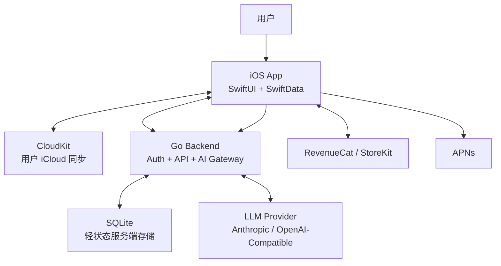
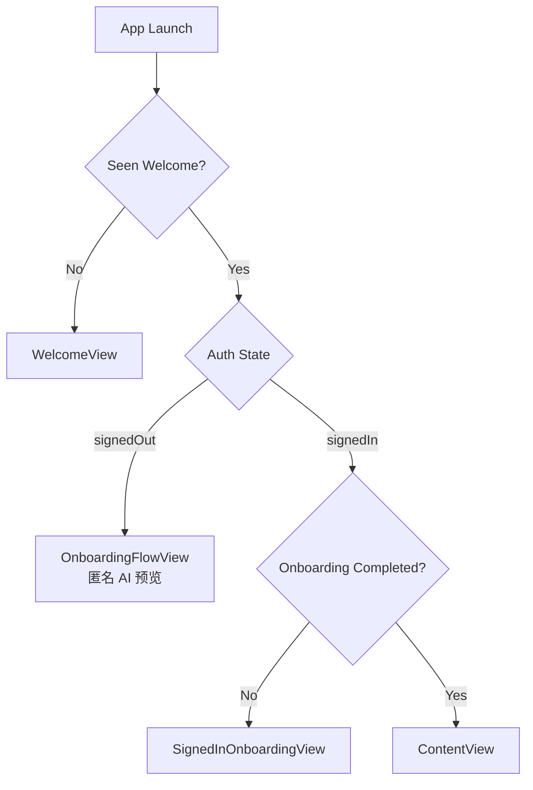
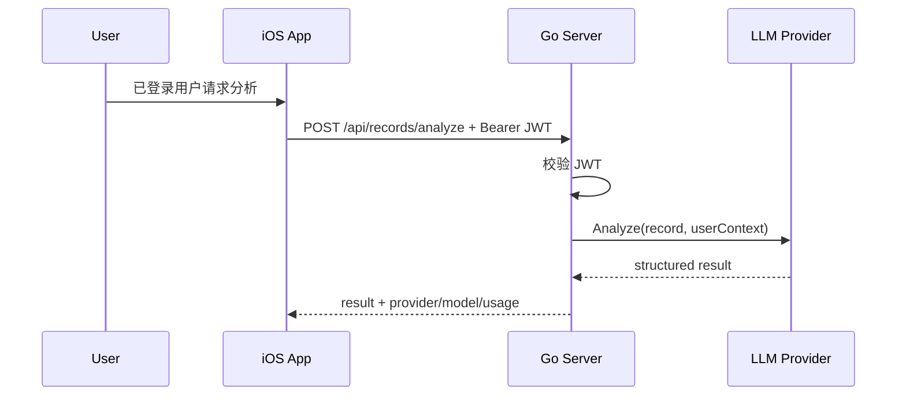

# Mory / Sprout 技术架构文档 v2.0

> 基于当前仓库代码生成  
> 更新时间：2026-05-13  
> 文档格式：Markdown  
> 适用范围：iOS App、Go Backend、AI 分析链路、认证与订阅、数据边界

## 1. 文档目标

本文档用于替代旧版 `Mory_技术架构文档_v1.0.docx`。  
旧版文档建立在“设备优先 + Core Data/CloudKit + 无状态 Go AI 中转层”的假设上，但当前项目已经演进为一套新的混合架构：

- iOS 端仍然是本地优先，但数据层已经切换为 `SwiftData`
- CloudKit 仍用于用户侧同步，但不再是文档唯一中心
- Go 后端不再只是纯 AI 转发层，而是承担了认证、JWT 会话、用户 onboarding 状态、推送设备注册等轻状态职责
- AI 能力被收敛为后端提供的分析服务接口，而不是文档中旧式的“独立 AI Agent 子系统”
- 订阅体系当前以客户端 `RevenueCat + StoreKit` 为主，服务端订阅校验仍处于 mock/默认层级阶段

这份文档只描述当前代码库中已经存在或可直接推导出的架构，不把未来规划写成既成事实。

## 2. 当前架构总览

### 2.1 总体定位

Mory（代码仓库名为 Sprout）当前采用的是一套**本地优先、账号接入、服务端辅助、AI 后端托管**的混合架构。

- 记录内容、卡片布局、人物关系、每日问题等核心用户内容保存在 iOS 本地 `SwiftData`
- 真机环境下允许通过 `CloudKit` 做 Apple 生态同步
- 服务端负责 Apple 登录验证、JWT 会话签发、轻量用户资料、设备推送注册、AI 分析接口
- AI 模型调用统一从 Go 后端发起，App 不直接持有 AI Provider Key
- 订阅购买主流程在 iOS 客户端侧完成，服务端目前只提供默认 tier 校验接口

### 2.2 架构分层



### 2.3 与旧版架构的关键差异

| 维度 | 旧版文档 | 当前新架构 |
| --- | --- | --- |
| 本地存储 | Core Data | SwiftData |
| 同步策略 | Core Data + CloudKit | SwiftData + CloudKit |
| 后端职责 | 纯无状态 AI 计算层 | 轻状态 API 服务层 |
| 服务端存储 | 原则上无业务数据 | SQLite 保存 push token 与 user profile |
| 认证 | 文档侧较弱 | Apple Sign In + 服务端 JWT |
| onboarding | 未形成闭环 | 匿名预览 + 登录后 onboarding 完成态 |
| 订阅 | 文档描述偏服务设计 | 当前以 RevenueCat/StoreKit 客户端为主 |
| AI 接入 | Claude API 单一路径 | Anthropic / OpenAI-Compatible 可切换 |

## 3. iOS 端架构

### 3.1 技术栈

- UI：`SwiftUI`
- 本地模型层：`SwiftData`
- 同步：`CloudKit`
- 登录：`AuthenticationServices`（Sign in with Apple）
- 本地安全：`Keychain`、`LocalAuthentication`
- 订阅：`RevenueCat`，并内置 `StoreKit fallback`

核心入口文件：

- `sprout/sprout/sproutApp.swift`
- `sprout/sprout/ContentView.swift`
- `sprout/sprout/Views/AuthGateView.swift`

### 3.2 App 启动与门禁流程

App 启动后先初始化以下全局能力：

- `SubscriptionManager`
- `AuthSessionManager`
- `BiometricLockManager`
- `InstallExperienceStore`
- `OnboardingPreviewService`
- `SwiftData ModelContainer`

门禁逻辑由 `AuthGateView` 统一决策，状态分为：

- `welcome`
- `anonymousOnboarding`
- `signedInOnboarding`
- `signedIn`
- `loading`

其含义不是单纯的“已登录/未登录”，而是把首次安装体验、匿名预览体验、登录后 onboarding 完成态分成了多段漏斗。



### 3.3 本地数据层

当前 `SwiftData` schema 由以下模型组成：

- `Record`
- `Person`
- `Decision`
- `MediaCard`
- `DailyQuestion`
- `Activity`
- `DashboardSystemCardConfig`

其中 `Record` 是核心聚合根，承载：

- 文本内容：`body`
- 标签：`tags`
- 情绪：`mood`、`intensity`
- 天气快照：`weather`、`temperature`、`feelsLike`、`humidity`、`weatherHigh`、`weatherLow`
- 位置：`location`、`latitude`、`longitude`
- 展示布局：`cardType`、`cardUnits`、`cardWidthColumns`、`dashboardCardSpanOverridesData`、`dashboardOrder`
- 关联关系：`mediaCards`、`mentionedPeople`、`linkedDecisions`、`activity`、`dailyQuestion`

这说明当前产品模型已经不是“单条日记 = 单个卡片”，而是：

- 一条 `Record` 可以映射出多个首页卡片
- 卡片尺寸与布局是容器化的、可覆盖的
- UI 展示层与底层记录实体之间存在一层 `Record -> DashboardCardInfo[]` 的映射

### 3.4 首页与卡片系统

当前首页是一个**容器优先的卡片编排系统**，而不是传统 timeline。

关键特征：

- 首页视图入口为 `ContentView`
- 实际内容由 `HomeModeContentView` 驱动
- 卡片排布由 `StickerGridLayout` 负责
- 每张卡片由 `CardContainerView` 承载
- `RecordMapper.allCards(record:)` 可以把一条记录扩展成最多 4 张 dashboard 卡片

当前支持从一条记录映射出的卡片类型包括：

- `photo`
- `music`
- `audio`
- `link`
- `map`
- `activity`
- `emotion`
- `weather`
- `todo`
- `people`
- `text`

这意味着当前前端架构是：

1. `Record` 负责内容聚合
2. `RecordMapper` 负责展示投影
3. `Cards/*` 负责具体卡片渲染
4. 布局系统负责卡片占位与响应式排布

### 3.5 输入与内容生成路径

用户在 `ContentView` 中通过底部输入条和多个 sheet 创建内容：

- 文本输入
- 图片
- 音频
- 音乐
- 地点
- 人物

辅助服务包括：

- `RecordParser`：识别 Apple Music URL 与普通 URL
- `RecordMapper`：把记录映射为卡片
- `MusicService`
- `SpeechRecognizer`

当前内容创建仍以**本地落库优先**为主，后端不参与主记录持久化。

### 3.6 CloudKit 策略

`sproutApp.swift` 中的 `ModelContainer` 配置表明：

- 真机环境：`cloudKitDatabase = .automatic`
- 模拟器环境：`cloudKitDatabase = .none`

这说明当前同步策略是：

- 生产使用 CloudKit 做用户设备间同步
- 本地开发和模拟器优先保证稳定启动，不强依赖 iCloud 账号状态

这是比旧文稿更工程化的策略，因为它显式规避了模拟器下 `CKAccountStatusNoAccount` 类启动问题。

## 4. 服务端架构

### 4.1 技术栈

- 语言：`Go`
- HTTP：标准库 `net/http`
- 存储：`SQLite`（`modernc.org/sqlite`）
- AI Provider：`Anthropic` 或 `OpenAI-Compatible`
- 部署：`Fly.io`

核心入口：

- `server/cmd/server/main.go`
- `server/internal/http/server.go`
- `server/internal/http/handlers.go`

### 4.2 服务端职责定位

当前后端不是重量业务后端，但也已经不是无状态中转层。它承担的是**轻状态业务网关**角色。

已实现职责：

- 健康检查与基础 metrics
- Apple 身份令牌校验
- JWT 会话签发与刷新
- onboarding 完成态写入
- AI 分析接口
- 推送设备 token 注册
- 默认订阅层级查询

未实现或仍为占位的部分：

- 真正的服务端订阅校验与 RevenueCat webhook 闭环
- 推送发送任务执行器
- 用户内容的服务端持久化
- 复杂的多租户业务域模型

### 4.3 服务端模块划分

```text
server/
  cmd/server/main.go                # 启动入口
  internal/config/                  # 环境变量与运行配置
  internal/http/                    # 路由、handler、中间件、metrics
  internal/auth/                    # Apple token 校验、JWT 签发与验证
  internal/ai/                      # AI provider 抽象与实现
  internal/db/                      # SQLite store
  internal/subscription/            # 订阅状态服务（当前为 mock/default）
```

### 4.4 HTTP API 现状

当前已注册接口如下：

| 方法 | 路径 | 鉴权 | 用途 |
| --- | --- | --- | --- |
| `GET` | `/healthz` | 否 | 健康检查 |
| `GET` | `/metrics` | 否 | 简单指标输出 |
| `POST` | `/auth/apple` | 否 | Apple 登录，签发 JWT |
| `POST` | `/auth/refresh` | 是 | 刷新 JWT |
| `POST` | `/api/onboarding/analyze-preview` | 否 | 匿名 onboarding AI 预览 |
| `POST` | `/api/records/analyze` | 是 | 记录 AI 分析 |
| `POST` | `/api/me/onboarding/complete` | 是 | 标记已完成 onboarding |
| `GET` | `/api/subscription/verify` | 是 | 查询当前 tier |
| `POST` | `/api/push/register` | 是 | 注册 APNs token |

这里最重要的变化是：**匿名预览接口与正式用户分析接口已经分离**。  
这让 onboarding 可以先体验 AI，再决定是否登录。

### 4.5 认证架构

认证链路如下：

1. iOS 使用 Sign in with Apple 获取 `identity_token` 与原始 `nonce`
2. 客户端把 `identity_token + nonce` 提交到 `/auth/apple`
3. 服务端从 Apple JWKS 拉取公钥并校验签名
4. 服务端验证 `issuer`、`audience`、`nonce`、`exp`
5. 服务端签发自有 JWT
6. 客户端把 JWT 保存在 Keychain 中，并用于后续 API 请求

服务端 JWT 当前特征：

- 自签 HMAC-SHA256
- 包含 `user_id`、`tier`、`iss`、`iat`、`exp`
- 支持 `/auth/refresh`

客户端会话管理特征：

- `AuthSessionManager` 持有会话状态
- 会话保存在 Keychain
- 接近过期时自动 refresh
- `development_stub` 模式可用于开发联调

### 4.6 服务端状态存储

当前 SQLite 仅保存轻量状态，不保存用户日记正文。

已落地表：

- `push_tokens`
- `user_profiles`

字段用途：

- `push_tokens`：按 `user_id + device_id` 唯一注册 APNs token、timezone、question-ready 状态
- `user_profiles`：记录用户是否完成 onboarding

这说明“服务端零存储”已经不再准确。  
更准确的说法应是：**服务端不保存核心记忆内容，但保存账户级运行状态。**

### 4.7 中间件与运行时治理

服务端已经具备基础工程治理能力：

- Request ID 注入
- Request timeout
- Panic recovery
- 统一 JSON error response
- 简单 metrics 聚合
- 结构化日志

这部分虽然轻量，但已经具备继续演化为生产 API 服务的骨架。

## 5. AI 分析架构

### 5.1 AI 能力定位

当前代码中的 AI 不是一个自主 Agent 系统，而是一个**结构化分析服务**。  
输入是记录文本与人物上下文，输出是结构化洞察结果。

请求结构：

- `record.content`
- `record.created_at`
- `record.tags`
- `persons[]`

响应结构：

- `tags`
- `emotion`
- `persons`
- `new_media`
- `insight`
- `follow_up`

这说明当前 AI 更像“日记解析与增强服务”，而不是多轮自治 Agent。

### 5.2 Provider 抽象

当前后端 AI provider 支持三种模式：

- `mock`
- `anthropic`
- `openai_compatible`

配置维度包括：

- `AI_MODE`
- `AI_PROVIDER`
- `AI_MODEL`
- `AI_API_KEY`
- `AI_BASE_URL`
- `HTTP_TIMEOUT`
- `AI_MAX_RETRIES`
- `AI_RETRY_BACKOFF`

这让后端具备了 provider 可切换性，而不是绑死在旧版文档中的 Claude 单一实现。

### 5.3 AI 调用路径

#### 匿名预览路径

```mermaid
sequenceDiagram
    participant U as User
    participant A as iOS App
    participant S as Go Server
    participant L as LLM Provider

    U->>A: 输入一段记忆
    A->>S: POST /api/onboarding/analyze-preview
    S->>L: Analyze(record)
    L-->>S: tags/emotion/insight/follow_up
    S-->>A: PreviewResult + mode=preview
```



#### 正式分析路径



### 5.4 当前边界与限制

已具备：

- 输入校验
- provider 抽象
- usage 元信息返回
- 匿名与正式分析链路拆分

当前尚未体现：

- 向量检索
- 长期记忆索引
- 多阶段 agent orchestration
- 服务端任务队列
- 分析结果服务端持久化

因此新文档不应再使用“AI Agent 中台”这类过重表述，除非后续代码真正落地。

## 6. 订阅与商业化架构

### 6.1 客户端订阅体系

客户端 `SubscriptionManager` 显示当前订阅体系以 `RevenueCat` 为主，并内置 `StoreKit fallback`。

主要职责：

- 拉取 offerings
- 选择 package
- 执行 purchase
- restore purchases
- 根据 entitlement 判断订阅状态
- 在 RevenueCat 不可用时退回原生 StoreKit 产品读取

这说明购买链路已经主要沉淀在 iOS 客户端，而不是服务端。

### 6.2 服务端订阅体系现状

当前服务端 `subscription.Service` 仍是轻量占位实现：

- 根据 `defaultTier` 返回用户 tier
- `source` 取决于 `SubscriptionMode`
- 还没有接入 RevenueCat 服务端校验或 webhook

所以当前准确表述应为：

- 客户端订阅链路较完整
- 服务端 tier 能力当前只是兼容 API 形态，并非正式账务真相源

## 7. 推送与通知架构

### 7.1 已实现部分

后端已实现 `/api/push/register`，并把以下信息写入 SQLite：

- `user_id`
- `device_id`
- `apns_token`
- `timezone`
- `has_question_ready`

这表示系统已经具备“设备注册”能力。

### 7.2 尚未实现部分

当前仓库中尚未看到：

- 后端主动发送 APNs 的执行逻辑
- 定时任务/cron 调度器
- 每日问题 ready 状态的服务端生成流程

因此现阶段推送架构应描述为：

- **注册链路已落地**
- **投递链路尚未落地或尚未纳入当前仓库**

## 8. 安全与隐私边界

### 8.1 核心原则

当前系统的安全边界应表述为：

- App 不直接持有 AI Provider Secret
- AI 请求统一经过后端
- 核心日记内容默认保存在本地 `SwiftData`
- CloudKit 同步由 Apple 账户体系承载
- 服务端只保存轻量账户运行状态，不保存完整本地内容库

### 8.2 密钥管理

服务端敏感配置通过环境变量加载：

- `JWT_SECRET`
- `AI_API_KEY`
- `HELICONE_KEY`
- Apple 验证相关配置

客户端敏感配置特征：

- RevenueCat Public SDK Key 通过 `Info.plist` / xcconfig 注入
- 后端 Base URL 通过 `MORY_API_BASE_URL` 注入
- JWT 保存在 Keychain

### 8.3 登录安全

Apple 登录安全点包括：

- Apple 官方 JWKS 校验
- `iss` 校验
- `aud` 校验
- `nonce` 校验
- `exp` 校验

这比旧文档中的概念式描述更接近真实生产安全链路。

### 8.4 本地安全

App 已集成本地生物识别锁：

- `BiometricLockManager`
- 进入后台后可重新锁定
- 重新激活时触发解锁认证

这表明当前客户端已经把“本地隐私保护”纳入正式架构，而不是纯功能附属项。

### 8.5 隐私表述修正

旧版“用户内容不写任何服务器数据库”这句话在当前架构里需要更精确：

- 用户完整记忆库不保存在本项目服务端数据库
- 但用户提交到 AI 分析接口的内容会经由服务端转发到模型提供方
- 服务端保存账户级轻状态数据，例如 onboarding 状态、push token

推荐对外统一表述为：

> 用户的核心记录内容默认保存在本地与其 iCloud 同步空间。  
> 当用户主动使用 AI 分析能力时，请求内容会经由我们的后端转发至模型服务，以完成分析，但当前服务端数据库不保存完整日记内容库。

## 9. 部署架构

### 9.1 iOS 端

iOS App 为标准本地应用部署形态：

- UI 和本地数据模型均内嵌于 App
- 真机启用 CloudKit
- RevenueCat 配置通过构建时注入

### 9.2 服务端

服务端部署目标为 `Fly.io`。

当前部署特征：

- 容器化部署
- SQLite 存储在 volume 上
- 默认可运行于 `mock AI` 模式
- 切换 live AI 时，通过环境变量决定 provider 与 model

### 9.3 环境模式

当前服务端天然支持多种环境模式：

- 开发环境：可启用 `DEV_AUTH_ENABLED`
- mock AI：本地或安全联调用
- live AI：接入真实模型供应商

这让项目可以在不同阶段逐步上线，而不需要一次性切完整生产链路。

## 10. 当前架构结论

### 10.1 一句话定义

Mory 当前的真实架构不是“纯设备端日记 + 无状态 AI 中转”，而是：

> 一套以 iOS 本地 SwiftData 为核心、以 CloudKit 做同步、以 Go 轻状态后端承载认证与 AI 接口、以 RevenueCat 驱动商业化的本地优先混合架构。

### 10.2 当前最准确的架构标签

可对内统一定义为：

- 本地优先架构
- 账号接入型移动应用
- 轻状态后端
- AI 增强型 journaling 系统
- 客户端主导订阅架构

### 10.3 旧文档中应废弃的描述

以下旧表述建议删除或改写：

- “Go 后端是纯计算层（无状态）”
- “服务端完全不保存任何用户相关数据”
- “架构核心是 Core Data + CloudKit”
- “AI Agent 设计”作为已落地大模块
- “服务端订阅校验已成为主真相源”

### 10.4 后续建议演进方向

如果后续继续演进，建议把 v2.0 之后的变化重点关注在：

- 服务端订阅真相源建设
- 推送发送链路落地
- AI 分析结果的可选持久化策略
- 匿名体验与正式用户数据衔接
- 是否引入真正的长期记忆检索与 agent 编排

---

## 附录 A：关键代码映射

### iOS

- App 入口：`sprout/sprout/sproutApp.swift`
- 门禁：`sprout/sprout/Views/AuthGateView.swift`
- 主界面：`sprout/sprout/ContentView.swift`
- 本地模型：`sprout/sprout/Models/*.swift`
- 卡片映射：`sprout/sprout/Services/RecordMapper.swift`
- 登录会话：`sprout/sprout/Services/AuthSessionManager.swift`
- 匿名 AI 预览：`sprout/sprout/Services/OnboardingPreviewService.swift`
- 订阅：`sprout/sprout/Services/SubscriptionManager.swift`

### Backend

- 启动入口：`server/cmd/server/main.go`
- 配置：`server/internal/config/config.go`
- 路由与中间件：`server/internal/http/server.go`
- 业务处理：`server/internal/http/handlers.go`
- Apple 认证：`server/internal/auth/apple.go`
- JWT：`server/internal/auth/auth.go`
- AI Provider：`server/internal/ai/*.go`
- SQLite：`server/internal/db/sqlite.go`
- 订阅占位服务：`server/internal/subscription/service.go`
