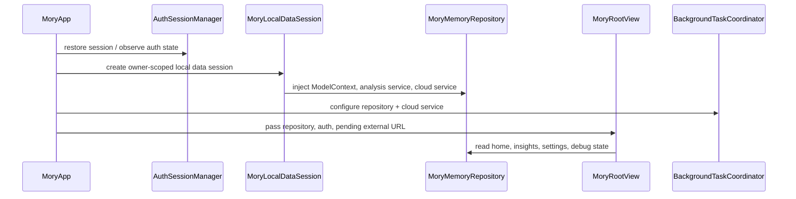
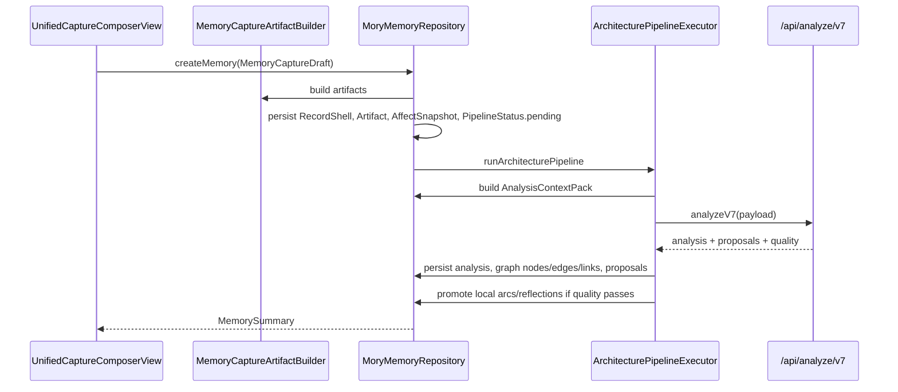
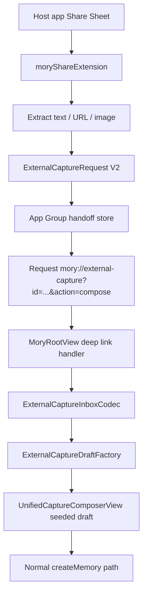
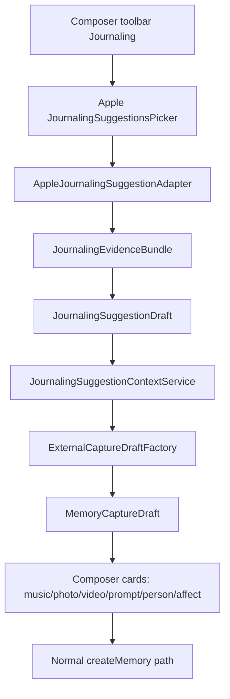
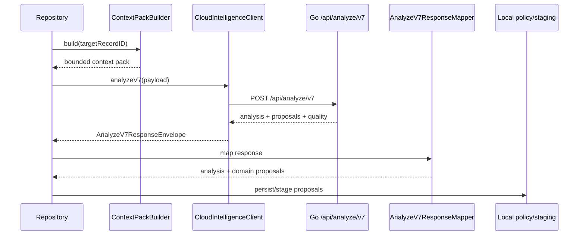
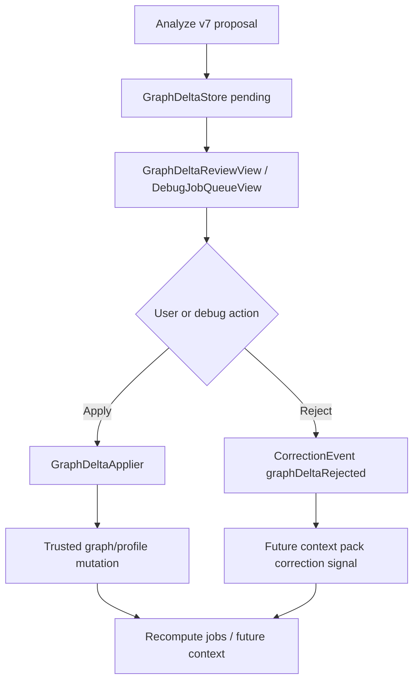
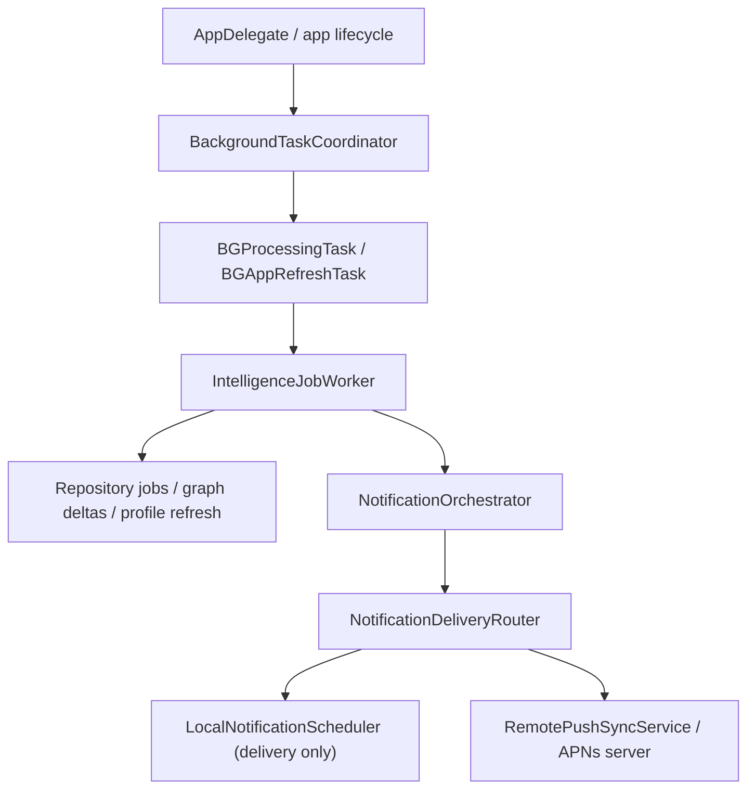

# 01. System Overview And Runtime Flows

本文梳理 Mory 当前的系统运行流。重点不是列文件，而是说明一次用户行为如何穿过 App shell、capture、persistence、analysis、server、proposal、debug 和 notification。

## 1. 系统总览

Mory 当前由四个运行单元组成：

| 单元 | 职责 | 主要边界 |
| --- | --- | --- |
| iOS App | 登录、记录、展示、分析、调试、设置、通知协调 | SwiftUI + SwiftData + platform services |
| Share Extension | 从系统 Share Sheet 接收文本、URL、图片，写入 App Group handoff payload | 不能直接依赖 App persistence |
| ExternalCaptureShared | App 与 extension 共用的 Codable wire contract 和附件引用 | 应保持可序列化、轻依赖 |
| Go server | Auth、Analyze v7、AI provider、push delivery、subscription verification | HTTP API + SQLite + provider adapters |

Mory 的核心产品链路是：

```mermaid
flowchart TD
    A["User captures memory"] --> B["MemoryCaptureDraft"]
    B --> C["SwiftData RecordShell + Artifact + AffectSnapshot"]
    C --> D["AnalysisContextPackBuilder"]
    D --> E["/api/analyze/v7"]
    E --> F["AnalyzeV7ResponseEnvelope"]
    F --> G["RecordAnalysisSnapshot"]
    F --> H["Proposals: Affect / GraphDelta / Arc / Reflection / Question"]
    G --> I["Entity graph + Arc/Reflection local promotion"]
    H --> J["Repository staging + policy"]
    J --> K["User review / Debug apply / CorrectionEvent"]
    K --> D
```

这个闭环是 v7 的核心：新记录不是孤立分析，而是触发一次有预算、有隐私边界、有历史证据的长期记忆更新。

## 2. App 启动与依赖装配

工作流：

当前逻辑判断：

- 依赖注入集中在 `MoryApp`、`MoryAppDependencies`、`MoryLocalDataSession`。
- `MoryLocalDataSession` 是 owner-scoped data vault 的关键入口。
- `MoryMemoryRepository` 仍接收 legacy `RecordAnalysisServing`，但新建记忆生产链路已切到 `CloudIntelligenceServing.analyzeV7`。

问题：

- App 入口装配了较多 runtime concern：Sentry、Auth、local data、remote push、background、external capture URL。
- `MoryMemoryRepository` 初始化依赖过多，说明 repository 仍在承担 application service 职责。

解决方向：

- 保留 `MoryLocalDataSession` 作为 composition root。
- 新增更小的 use case service，例如 `MemoryCreationService`、`ExternalCaptureImportService`、`AnalysisPipelineService`，让 `MoryMemoryRepository` 逐步回到 persistence facade。

## 3. 普通新建记忆流程

输入：

- `MemoryCaptureDraft`
- `CaptureArtifactDraft`
- `AffectSnapshotDraft`
- 自动上下文：location、weather、music、Journaling、external capture

输出：

- `RecordShell`
- `Artifact`
- `AffectSnapshot`
- `RecordAnalysisSnapshot`
- `EntityNode` / `EntityEdge` / `ArtifactEntityLink`
- `GraphDelta` / `ReflectionSnapshot` / `ClarificationQuestion` / `TemporalArc`

问题：

- `createMemory` 同时负责记录创建、artifact build、affect 持久化、pipeline status、indexing、pipeline trigger。
- pipeline 失败语义依赖 repository 的状态更新和 debug trace，事务边界需要继续细化。

解决方向：

- 将“保存草稿”和“启动分析”拆成两个 use case，但保持用户侧一个 save 行为。
- 为 pipeline 增加独立 status writer，避免分析失败污染 record save。

## 4. Share 到 Composer 流程

设计意图：

- 正式体验是 handoff-first：用户从 Share 进入 Mory 的统一新建记忆页。
- Inbox 是 debug/recovery fallback，不是产品主入口。
- Share Extension 不能依赖 App 内 repository，只能写 App Group payload。

问题：

- `ExternalCaptureShared` 同时定义 wire contract 和 attachment file store，职责偏重。
- `ShareViewController` 仍是 UIKit 单文件控制器，提取、确认 UI、写入、open URL 都在一个文件内。

解决方向：

- `ExternalCaptureShared` 拆成 `WireModels`、`AttachmentStore`、`InboxModels`。
- Share Extension 拆出 `SharePayloadExtractor`、`ShareConfirmationViewModel`、`ShareHandoffCoordinator`。

## 5. Journaling Suggestions 流程

当前设计是正确的：Journaling Suggestion 不是新 memory type，而是普通 memory 的多类型 context source。

关键规则：

- 多首歌应变成多个 music card。
- artwork/icon/contact photo/event poster image 不应错误变成独立 photo memory card。
- `StateOfMind` 是高可信 affect evidence，不伪造 arousal/dominance。
- Reflection prompt 应进入 prompt-answer card，而不是只拼进正文。
- Contact 是 person context evidence，不直接合并 trusted person graph。

问题：

- `JournalingEvidenceBundle.flattenedEvidenceItems` 暴露 flatten 接口，可能让后续实现绕过 typed mapping。
- `AppleJournalingSuggestionAdapter` 与 `ExternalCaptureDraftFactory` 的字段覆盖需要真机建议长期验证。

解决方向：

- typed bundle 作为唯一正式转换入口。
- flatten 仅限 diagnostics/export，命名上标出 `diagnosticFlattenedEvidenceItems`。

## 6. Analyze v7 到 proposals 流程

边界：

- Cloud AI 不直接写 trusted graph。
- `GraphUpdater` 仍从 authoritative analysis 生成基础 graph links。
- `GraphDelta`、merge/split、自我档案重大变化和敏感关系走 staging/review/correction。

问题：

- `ArchitecturePipelineExecutor` 直接 import SwiftData 并接收 `ModelContext`，pipeline 和 persistence 绑定。
- Analyze v7 request/response models 文件较大，后续 provider capability 扩展会继续增长。

解决方向：

- 为 pipeline 引入 `AnalysisPipelineQuerying` 与 `AnalysisPipelineWriting`。
- 将 Analyze v7 request payload、response envelope、mapper、quality/capabilities 拆为多个文件。

## 7. GraphDelta 与 Correction 流程

问题：

- Apply/reject 已有 repository path，但 UI 体验仍偏 debug-first。
- `GraphDeltaApplier` 的 operation support 需要和 v7 response contract 保持同步。

解决方向：

- 建立 `ProposalReviewService`，统一 GraphDelta、Person merge/split、Affect correction、Profile update review。
- CorrectionEvent 必须进入 ContextPack correction signals，防止错误复发。

## 8. Background / Notification 流程

当前能力：

- BGTask identifiers 已在 Info.plist。
- Notification intent、delivery router、local scheduler、remote push sync 有对应实现和 tests。
- Debug Center 可触发和查看部分 job/notification 状态。

问题：

- iOS 后台机制不能保证实时，产品文案和 debug 面板需要持续强调 approximate scheduling。
- Notification routing 的 tests 曾出现 SwiftData 生命周期 race，说明测试应尽量用 mock repository。

解决方向：

- 后台任务使用小端口 repository，不在 worker test 里启动完整 SwiftData stack。
- 对 BGTask/APNs 做真机长测文档，而不是只依赖 simulator。

## 9. Debug 工作流

Debug 体系当前承担：

- Analysis Context Pack inspection。
- Affect snapshots inspection。
- GraphDelta apply/reject。
- Notification/BGTask diagnostics。
- Server health / cloud intelligence debug。
- Capture card lab。
- Full diagnostics report。

问题：

- Debug 是必要的，但部分 debug view 过大，report builder 和 view 混在一起。
- Debug 可以直连 repository，但不能定义业务事实；业务事实必须来自 Domain / Repository / Infrastructure。

解决方向：

- 把 Debug 拆成 inspect view、action view model、report formatter。
- Debug action 必须调用正式 repository action，不新增旁路 mutation。
