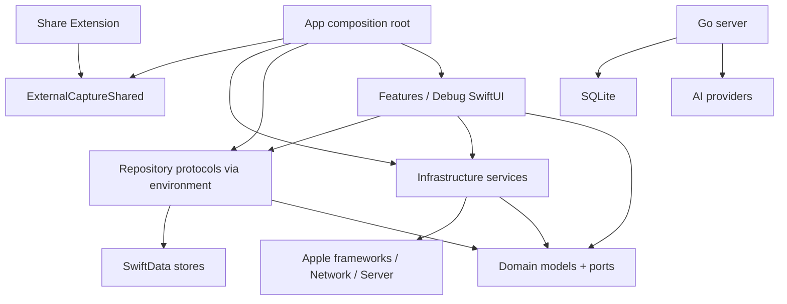

# 02. Layer Boundaries And Dependency Audit

本文定义当前 Mory 分层的实际状态、允许依赖、发现的问题和推荐边界。重点是让后续架构 AI 与 UI AI 可以并行工作，不互相踩 durable business logic。

## 1. 目标依赖方向

原则：

- `Domain` 不导入 SwiftUI、SwiftData、UIKit、JournalingSuggestions、UserNotifications。
- `Features` 只做展示和交互，调用 repository/use case，不拥有 durable mutation semantics。
- `Infrastructure` 可以接 Apple framework、network、AI、search、background，但不应该直接拥有 SwiftUI 页面。
- `Persistence` 可以依赖 SwiftData 和 Domain，但不应该知道具体 SwiftUI view。
- `Debug` 可以读取更多内部状态，但所有 mutation 必须走正式 domain/repository action。
- Share Extension 只能依赖 shared wire contract 和 extension-local extraction/writer。
- Go server 不知道 iOS SwiftData；只通过 HTTP JSON contract 协作。

## 2. 当前实际依赖状态

| 层 | 当前状态 | 评价 |
| --- | --- | --- |
| Domain | 没有直接导入 SwiftData/SwiftUI；包含模型和 repository protocol | 基础方向正确，但 `MemoryFeatureModels.swift` 过载 |
| Infrastructure | 连接 Analysis、Context、Notifications、Networking、Auth、Search | Pipeline 已通过 ports 与 SwiftData 分离；后续重点是继续拆 service/handler |
| Persistence | SwiftData store、mapper、repository 已拆分 | 文件组织改善明显，但 repository 类型仍过大 |
| Features | 原生 SwiftUI 页面，依赖 repository protocol | 合理，但多个 view 文件过大，部分页面直连过多功能 |
| Debug | 大量诊断 UI 和 action | 合理存在，但 debug view 与 formatter/action 混合 |
| ExternalCaptureShared | App/extension 共享 Codable contract | 方向正确，但包含 attachment file IO，职责偏宽 |
| Share Extension | UIKit controller 提取 payload 并写入 inbox/handoff | 功能边界正确，文件可继续拆 |
| Server | Go HTTP、AI provider、SQLite、notification | 模块方向清楚，大文件风险上升 |

## 3. 主要越界与模糊边界

### 3.1 Repository protocol 超大

`MoryMemoryRepositorying` 放在 Domain，并被 Features、Infrastructure、Debug、Notifications 等广泛使用。问题不在“protocol 在 Domain”，而在它把所有 use case 聚合为一个端口。

影响：

- 单元测试需要实现大量无关方法。
- 一个 feature 的小变更可能触碰全局协议。
- UI AI 容易误用 repository 中不该暴露给正式 UI 的 debug/action 方法。

建议：

- 将协议拆成：
  - `MemoryRecordRepositorying`
  - `MemoryMutationRepositorying`
  - `ProfileRepositorying`
  - `GraphRepositorying`
  - `AnalysisRepositorying`
  - `ExternalCaptureRepositorying`
  - `NotificationIntentRepositorying`
  - `DebugRepositorying`
- App environment 可继续注入一个 composite repository，但 view/use case 只接收所需小端口。

### 3.2 Pipeline ports 已完成，repository 仍承担 adapter

`AnalysisExecutor` 在 Infrastructure/Analysis/Pipeline 下，已通过 `AnalysisPipelineQuerying`、`AnalysisPipelinePersisting`、`AnalysisPipelineTracing`、`AnalysisPipelineRuntimeScoping`、`AnalysisContextPacking` 与 SwiftData/`ModelContext` 分离。

影响：

- Pipeline 本身已经可以用 mock ports 测试。
- 剩余风险在 `MoryMemoryRepository` 同时作为 SwiftData-backed adapter 和 use case facade，后续功能仍可能把编排逻辑继续塞回 repository。

建议：

- 保持 pipeline 只依赖 ports。
- 下一步抽 `MemoryCreationService`、`MemoryMutationService`、`ExternalCaptureImportService` 等 use case service，逐步减轻 repository facade。

### 3.3 ExternalCaptureShared 同时做合同和 IO

共享模块中同时存在 Codable wire models、Journaling evidence bundle、attachment file store、inbox error。

影响：

- Share Extension 和 App 都被迫编译同一个较大文件。
- 纯 JSON contract 与 App Group file IO 生命周期混在一起。
- 后续增加 Widget/AppIntent 入口时会继续膨胀。

建议：

- 拆为：
  - `ExternalCaptureWireModels.swift`
  - `ExternalCaptureAttachmentModels.swift`
  - `ExternalCaptureAttachmentStore.swift`
  - `JournalingEvidenceBundle.swift`
  - `ExternalCaptureInboxModels.swift`

### 3.4 Debug 可以 inspect，但不能定义事实

Debug 当前能触发 GraphDelta apply、BGTask、quality tuning、diagnostics replay。这个能力对开发很重要，但必须保证 mutation 都走正式 repository action。

建议：

- Debug view 只持有 view state。
- Debug action 调用 use case/repository。
- Debug report formatter 纯函数化，便于测试。
- Debug-only seed/clear 方法保持在 `DebugRepositorying`，不进入正式 feature 端口。

### 3.5 Server handler/db 文件逐渐成为同类 God files

Go server 的 `handlers.go` 和 `sqlite.go` 文件超过 1000 行，当前还可维护，但继续加 v8/v9 API 会快速恶化。

建议：

- HTTP handlers 按 auth/analyze/reflection/push/subscription/eval 拆文件。
- SQLite store 按 push token、push delivery、user profile、migration 拆文件。
- AI provider 按 Analysis、Reflection 和其他 intelligence operation 继续拆。

## 4. 允许依赖矩阵

| From / To | Domain | Infrastructure | Persistence | Features | Debug | Shared | Server |
| --- | --- | --- | --- | --- | --- | --- | --- |
| Domain | yes | no | no | no | no | limited models only | no |
| Infrastructure | yes | yes | no direct SwiftData except current exceptions | no | no | yes | HTTP only |
| Persistence | yes | yes for helper services | yes | no | no | yes | no |
| Features | yes | yes through services | repository protocols only | yes | no | yes | no |
| Debug | yes | yes | repository protocols / explicit debug ports | can reuse small components | yes | yes | HTTP debug client only |
| Share Extension | shared only | no app infrastructure | no | no | no | yes | no |
| Server | JSON contract only | no Swift code | no | no | no | no | yes |

## 5. 解决方案路线

1. 先拆 repository protocol，不急着继续拆文件。
2. 维持 Analysis pipeline ports 边界，继续抽 use case service，避免 `ModelContext` 编排回流。
3. 将 ExternalCaptureShared 纯合同化，把 attachment IO 分文件。
4. Debug 继续保留，但拆 view、action、formatter。
5. Server 在新增 v8 API 前先拆 handler/db 大文件。

这条路线优先减少跨层耦合，而不是单纯追求每个文件都很短。
