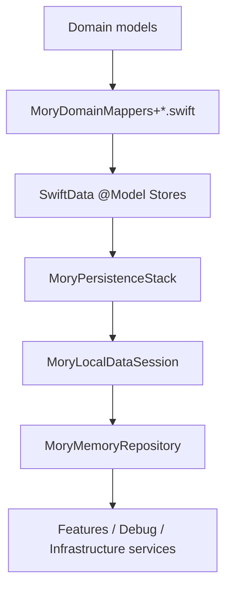
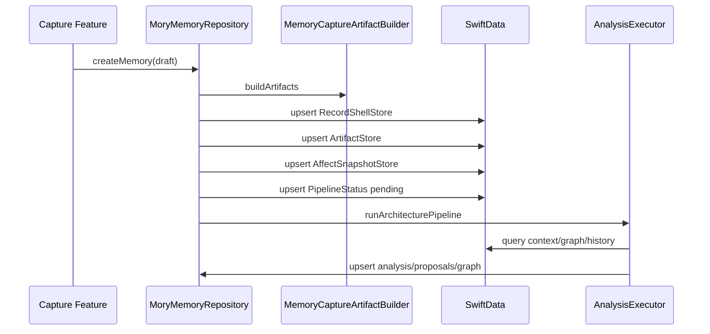
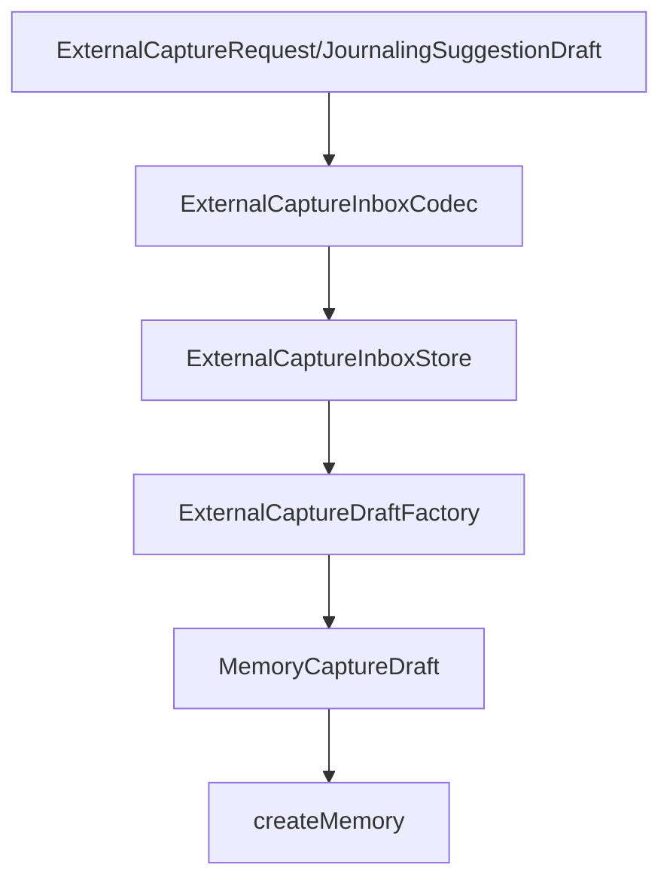

# 04. Persistence Repository And Data Model Audit

Persistence 是当前 Mory 最大的架构压力点。SwiftData store 和 mapper 已经按领域拆分，但 repository 仍是多个业务域的集中执行者。

## 1. 当前 Persistence 结构

目录职责：

| 目录 | 职责 | 状态 |
| --- | --- | --- |
| `Persistence/Models` | SwiftData `@Model` store families | 已按 Record/Profile/Entity/Intelligence 等拆分 |
| `Persistence/Mappers` | Domain <-> Store 转换 | 已按领域拆分 |
| `Persistence/Repositories` | Repository implementation 与业务事务 | 文件拆分完成，但类型仍大 |
| `Persistence/Stack` | ModelContainer、owner-scoped local data session | 边界清楚 |

## 2. Store Models

输入：

- Domain model。
- SwiftData query/update。

输出：

- persisted store objects。
- mapper 可读取的 domain model。

当前优点：

- 不再集中在一个巨型 `MoryStoreModels.swift`。
- Store families 与业务域基本匹配：Record、Profile、Entity、Intelligence、Notification、Preference、Composition、Reflection。

问题：

- SwiftData schema 增长较快，migration 约束会越来越重要。
- Store model 字段通常通过 JSON Data 存复杂数组，这能快速迭代，但可查询性较弱。

解决方案：

- 发布前锁定 schema 版本和 migration 文档。
- 对高频查询字段保持一等列；低频结构继续 JSON。
- 为每个 store family 增加“查询场景说明”，避免误把所有字段 JSON 化。

## 3. Mappers

输入：

- Store object 或 Domain model。

输出：

- Domain model 或 Store object。

优点：

- mapper 已从一个大文件拆成领域扩展，方向正确。
- `PersistenceCoding` 抽出 JSON encoding/decoding helper。

问题：

- mapper 中如果开始出现业务判断，会破坏边界。
- JSON decode fallback 如果静默返回空值，可能隐藏迁移或数据损坏问题。

解决方案：

- mapper 只做结构转换，不做 policy。
- 对关键字段 decode failure 记录 diagnostics 或 debug warning。
- 用 mapper tests 覆盖每个 store family 的 roundtrip。

## 4. Repository Implementation

当前 repository extension 拆分：

- `MoryMemoryRepository+Records`
- `MoryMemoryRepository+Composition`
- `MoryMemoryRepository+EntityGraph`
- `MoryMemoryRepository+Analysis`
- `MoryMemoryRepository+Debug`
- `MoryMemoryRepository+People`
- `MoryMemoryRepository+Intelligence`
- `MoryMemoryRepository+Notifications`

这改善了文件可读性，但没有改变一个事实：所有 extension 仍属于同一个 `MoryMemoryRepository` 类型，共享同一组内部依赖和 helper。

## 5. Repository 工作流：新建记忆

问题：

- `createMemory` 是 use case，不只是 repository insert。
- 同一个方法触发 storage、analysis、indexing、pipeline status。
- pipeline 出错时需要非常明确地保证 record save 成功、derived state 不半写。

解决方案：

- 建议引入 `MemoryCreationService`：
  - repository 负责 primitive persistence。
  - service 负责编排 create + pipeline trigger + index。
  - pipeline status writer 独立注入。

## 6. Repository 工作流：编辑/变更记忆

当前方向正确：

- 编辑通过 repository mutation path。
- mutation 后由 repository 统一处理 derived data invalidation、pipeline status、refresh policy。

问题：

- 变更路径仍位于大 repository 中。
- 不同 mutation 的副作用很容易遗漏：Spotlight、home board、graph links、arcs、reflections、profiles、questions。

解决方案：

- `MemoryMutationService` 封装 record/artifact mutation。
- `DerivedDataInvalidationService` 统一决定哪些 store 要清理。
- mutation result 保持 domain snapshot，供 UI 展示。

## 7. Repository 工作流：Person / Place / Entity

当前能力：

- Place profile rename/merge/split。
- Person profile mutation。
- Person merge/split。
- Entity tombstone 和 correction event。

问题：

- Person/Place/Entity mutation 都在 repository 内，helper 很多。
- merge/split 需要重写 links、edges、profiles、arcs、reflections、source IDs，事务复杂。

解决方案：

- 抽 `EntityMutationService`：
  - `mergeEntities`
  - `splitEntity`
  - `rewriteEntityReferences`
  - `deduplicateEdges`
  - `createTombstone`
- repository 提供低层 fetch/upsert/delete。

## 8. Repository 工作流：External Capture

当前路径：

优点：

- 外部入口最终进入普通 `MemoryCaptureDraft`。
- 不存在特殊 `JournalingMemory` 类型。
- Inbox/recovery 与正式 create path 分离。

问题：

- `enqueueExternalCapture`、`createMemoryFromExternalCaptureInboxItem` 位于 repository notifications extension，命名上不够准确。

解决方案：

- 拆 `MoryMemoryRepository+ExternalCapture.swift`。
- 或单独建立 `ExternalCaptureImportService`。

## 9. Repository Protocol 问题

`MoryMemoryRepositorying` 当前聚合：

- record create/edit/fetch/search
- timeline/library/home board
- place/person/entity/profile
- graph overview
- temporal arcs/reflections
- debug fixture/diagnostics
- quality tuning
- settings/preferences
- feature flags
- jobs/questions/graph delta
- notification intents
- external capture inbox
- pipeline trace

影响：

- 每个 test mock 都必须知道太多东西。
- service 很难声明最小依赖。
- UI 能看到过多 mutation surface。

推荐拆分：

| 小端口 | 方法范围 |
| --- | --- |
| `MemoryRecordRepositorying` | create/fetch/update/delete records and artifacts |
| `MemorySearchRepositorying` | text/semantic/Spotlight search |
| `CompositionRepositorying` | home board, timeline, insights presentation |
| `ProfileRepositorying` | self/entity/person/place profile |
| `GraphRepositorying` | graph nodes/edges/links, GraphDelta |
| `AnalysisRepositorying` | analysis snapshots, arcs, reflections, context pack reads |
| `QuestionRepositorying` | clarification questions |
| `NotificationIntentRepositorying` | notification intents/preferences |
| `ExternalCaptureRepositorying` | inbox/handoff import |
| `DebugRepositorying` | fixtures, diagnostics, quality tuning |

## 10. 事务边界建议

需要强事务的操作：

- create memory primitive save。
- memory mutation + invalidation。
- entity merge/split rewrite。
- GraphDelta apply。
- external capture mark imported after create success。

可以异步或 eventually consistent 的操作：

- Spotlight indexing。
- background recompute job enqueue。
- notification intent preparation。
- profile portrait refresh。
- context pack debug inspection。

## 11. 文件大小风险

| 文件 | 行数级别 | 风险 | 建议 |
| --- | --- | --- | --- |
| `MoryMemoryRepository.swift` | 2400+ | helper 和 shared dependency 仍集中 | 拆类型职责和协议，不只是继续切文件 |
| `MoryMemoryRepository+People.swift` | 700+ | entity/person/place mutation 同文件 | 拆 EntityMutation、PlaceProfile、PersonProfile |
| `MoryMemoryRepository+Records.swift` | 700+ | create/mutate/fetch/search/index 混合 | 拆 create/mutation/search helpers |
| `MemoryFeatureModels.swift` | 1200+ | Domain 总线 | 拆 domain model groups |

## 12. 推荐优先级

1. 拆 repository protocols，降低依赖面。
2. 抽 entity mutation service，降低 merge/split 风险。
3. 抽 memory creation/mutation use case，明确事务。
4. 拆 `MemoryFeatureModels.swift`。
5. 为 store mapper roundtrip 增加按 family 的测试。
