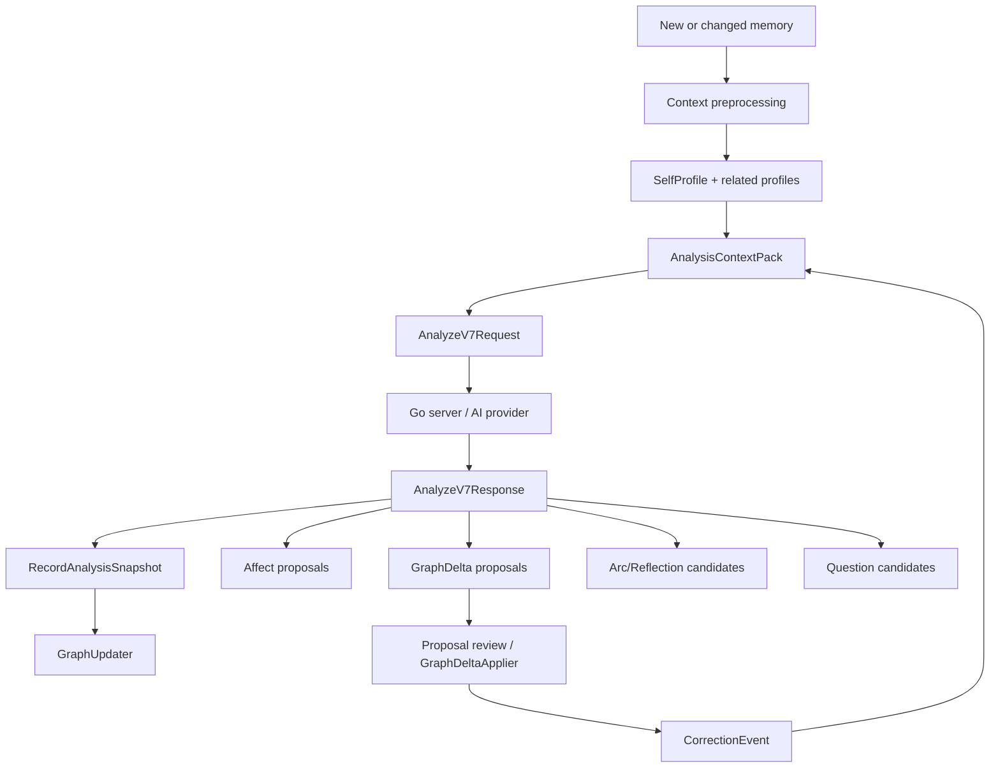

# 05. AI Intelligence Architecture Audit

本文审计 Mory v7 的长期智能层：SelfProfile、AnalysisContextPack、Analyze v7、Entity Resolution、GraphDelta、PersonProfile、AffectSnapshot、Arc/Reflection 和 background intelligence jobs。

## 1. 当前智能层总流

当前方向正确：AI 输出以 proposal-first 进入本地 staging，而不是直接写 trusted graph。

## 2. SelfProfile

职责：

- 表示用户本人。
- 支持第一人称、自称、角色、目标、偏好、敏感边界、表达习惯。
- 进入 context pack 的 `selfBrief`。

输入：

- onboarding/default profile。
- 用户 correction。
- affect correction expression pattern。
- profile mutation。

输出：

- `SelfProfile`
- `SelfContextBrief`

问题：

- SelfProfile 已有本地模型和 persistence，但 UI/编辑体验仍偏 debug/基础。
- 用户本人实体与 person/entity graph 的关系需要继续明确：SelfProfile 是中心主体，不应被普通 person merge 误合并。

解决方案：

- 增加 `SelfProfilePolicy`：定义哪些字段可自动更新、哪些必须用户确认。
- 将“这是我自己”作为 correction action，进入 entity resolution negative/positive evidence。

## 3. AnalysisContextPack

职责：

- 在 Analyze 前召回有限历史证据。
- 控制预算、排序、隐私 gate。
- 将 profiles、related memories、arcs、reflections、corrections、affect history 结构化发送。

输入：

- 当前 record。
- recent/search memories。
- profiles。
- arcs/reflections。
- correction events。
- affect snapshots。

输出：

- `AnalysisContextPack`
- budget report。
- privacy decisions。
- retrieval report。

优点：

- 解决了 v6 “只分析当前记忆”的核心问题。
- 有预算和 privacy gate，避免全历史打包。

问题：

- `ContextPackBuilder` 依赖大 repository protocol。
- ranking/correction penalty 的产品指标还需要长期 eval。

解决方案：

- context builder 依赖 `ContextPackSourceRepositorying` 小端口。
- 将 ranking feature 以可解释字段输出到 debug/eval。

## 4. Analyze v7

职责：

- iOS 构造 v7 payload。
- Go server 走 v7-native prompt/parser/provider path。
- 返回 analysis + proposals + quality。

输入：

- record shell。
- artifacts。
- known entities。
- context pack。
- affect snapshots。

输出：

- `AnalyzeV7ResponseEnvelope`
- `RecordAnalysisSnapshot`
- proposals。

问题：

- iOS `AnalyzeV7Models.swift` 文件较大。
- server v7 types 中仍存在从 legacy analysis 构造 v7 proposal 的 helper，容易让人误解为 AI 原生 proposal 已完全独立。

解决方案：

- iOS 拆 request/response/mapper/capabilities。
- server 文档明确：当前 native v7 contract 已是主路径，但部分 deterministic proposal builder 仍是 compatibility bridge。

## 5. Entity Resolution

职责：

- 判断 mention 与已知 entity/self/person 是否相同。
- 读取 negative evidence。
- 支持 CJK 名字和自指边界。
- 给 merge/split/correction 提供基础。

输入：

- mention。
- entity profiles。
- self profile。
- correction events。
- tombstones。

输出：

- resolution result。
- merge candidate。
- not-same blocking。

当前已修方向：

- not-same blocking 不应依赖 hintedEntityID。
- CJK 自指和中文姓名 normalize 需要特殊处理。

问题：

- Entity resolution 是长期个性化核心，但当前 UI 纠错仍基础。
- “舍友”等 role/group entity 需要更明确的 ambiguous bucket 模型。

解决方案：

- 增加 `AmbiguousEntityCluster` 或在 correction event 中明确 role/group。
- 所有 merge proposal 必须携带 evidence 和 negative evidence check。

## 6. GraphDelta

职责：

- 表示 AI 或本地规则提出的 graph/profile mutation。
- 支持 apply/reject/undo-reject。
- 将用户纠错写回未来 context。

输入：

- Analyze v7 proposal。
- clarification answer。
- debug/manual action。

输出：

- staged `GraphDelta`。
- trusted graph/profile mutation。
- `CorrectionEvent`。

问题：

- GraphDelta operation 支持必须持续和 server v7 contract 对齐。
- UI review 仍偏基础，缺少完整解释和撤销体验。

解决方案：

- 建立 `ProposalReviewService` 统一 apply/reject。
- GraphDelta apply 必须幂等并可解释。
- 高风险 operation 不自动 apply。

## 7. PersonProfile / Portrait

职责：

- 从 entity/person memories 聚合人物画像。
- 保存关系、互动频率、情绪模式、portrait summary、field evidence。
- 支持用户备注和 policy。

输入：

- entity profile。
- memories。
- graph edges。
- affect snapshots。
- user mutation。

输出：

- `PersonProfile`
- `PersonPortrait`
- `ProfileFieldEvidence`

问题：

- 本地 deterministic portrait 是 foundation，AI portrait proposal 仍需要更强 evidence UX。
- Contact evidence 暂不直接合并人物，这是正确保守策略，但需要后续 resolution UI。

解决方案：

- PersonProfile field-level review。
- contact-to-person resolution 作为独立 flow，不自动 merge。

## 8. AffectSnapshot

职责：

- 替代单一 `userMood`。
- 保存 valence/arousal/dominance/intensity、labels、tone hints、appraisal、source、evidence。
- 接收用户手动、Journaling StateOfMind、AI proposal、correction。

输入：

- StructuredMoodPicker。
- Journaling `StateOfMind`。
- Analyze v7 affect proposal。
- AffectCorrection。

输出：

- `AffectSnapshot`
- affect history brief。
- self expression pattern update。

问题：

- legacy `RecordShell.userMood` 仍存在，作为摘要回填可以接受，但不应成为真实情绪来源。
- StateOfMind 官方字段和 Mory 自定义 label 的映射需要保持 raw metadata。

解决方案：

- 所有非手动来源都保存 raw official metadata。
- UI 显示 raw label fallback，避免“心情添加失败”。

## 9. Arc / Reflection

职责：

- 将多条记忆聚合成时间线/阶段/反思。
- 既接收 Analyze v7 candidates，也保留本地 deterministic promotion。

输入：

- analysis snapshots。
- artifacts。
- graph links。
- context pack。
- server candidates。

输出：

- `TemporalArc`
- `ReflectionSnapshot`

问题：

- local promotion 与 cloud candidates 需要更明确优先级。
- Reflection quality gate 仍偏保守，早期用户价值可能弱。

解决方案：

- 在 debug/eval 中展示 cloud candidate 与 local candidate 的取舍。
- 明确低证据时只出 lightweight insight，不出强人生结论。

## 10. Intelligence Jobs

职责：

- 后台执行 graph delta apply、profile refresh、reflection/archive、notification preparation 等任务。

输入：

- `IntelligenceJob`
- repository state。
- BGTask / app recovery trigger。

输出：

- updated job status。
- durable mutation。
- notification intent。

问题：

- Worker 依赖大 repository protocol。
- job kind 增多后 worker 容易膨胀。

解决方案：

- 每类 job 拆 handler。
- worker 只负责调度、状态、错误记录。

## 11. 智能层问题优先级

| 优先级 | 问题 | 解决方案 |
| --- | --- | --- |
| P0 | repository port 过大影响所有智能 service | 拆最小端口 |
| P0 | pipeline 绑定 SwiftData | 引入 query/persist ports |
| P1 | GraphDelta/Proposal review UX 不完整 | 统一 ProposalReviewService |
| P1 | entity ambiguous role/group 模型不足 | 增加 ambiguous cluster 或 correction schema |
| P2 | AI portrait proposal 与 evidence UI 不够强 | field-level profile review |
| P2 | local/cloud arc candidate 优先级不透明 | debug/eval 展示候选来源 |
