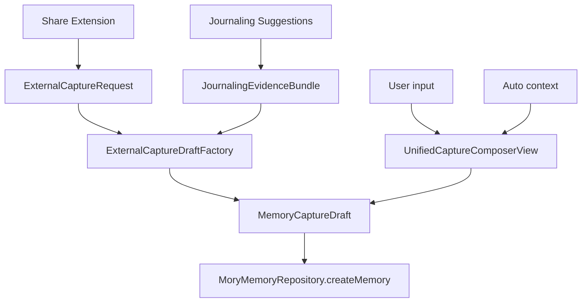
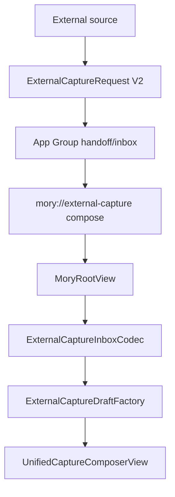
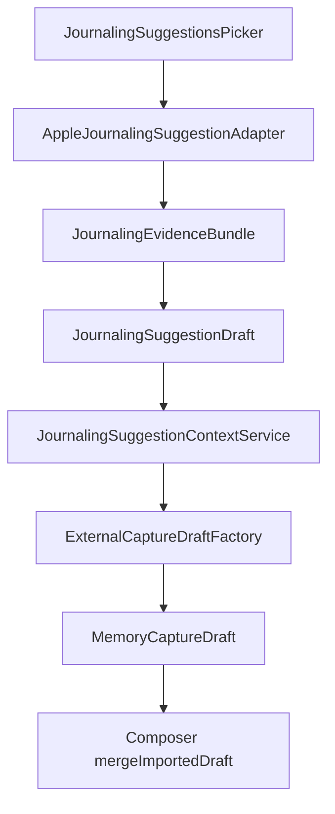

# 06. Capture Context And Journaling Audit

Capture 是 Mory 的入口层，也是 v7 长期智能能否有足够证据的关键。本文件审计普通 composer、capture cards、external capture、Share Extension、Journaling Suggestions 和 system context。

## 1. Capture 总流

输入类型：

- text
- photo / video
- audio
- link
- location / weather / music
- structured mood
- Journaling media / StateOfMind / prompt / contact / activity
- Share text / URL / image

输出统一为：

- `MemoryCaptureDraft`
- `CaptureArtifactDraft`
- `AffectSnapshotDraft`

这是正确边界：任何外部输入都必须回到普通记忆创建路径。

## 2. Unified Capture Composer

职责：

- 聚合正文、附件草稿、structured mood、Journaling import、external seed。
- 保存时调用 repository。

问题：

- `UnifiedCaptureComposerView` 仍接近 1000 行。
- composer 同时管理多个 sheet、camera/audio/link/music/todo/location/Journaling/import state。

解决方案：

- 抽 `CaptureComposerViewModel` 管理草稿状态。
- 每种输入 sheet 保持独立小 view。
- 保存逻辑保持单一入口。

## 3. Capture Cards

职责：

- 以统一 card system 展示 composer/detail/debug 中的 artifact。
- 使用 typed payload 和 adapters。

优点：

- `CaptureCardModels`、`CaptureCardAdapters`、`CaptureCardPresentation` 已形成良好方向。
- prompt/person/affect/video/music 等新类型可以进入同一 card 系统。

问题：

- `CaptureCardView.swift` 仍包含多个 card content view，超过 1300 行。
- 新增 card type 会继续扩大这个文件。

解决方案：

- 按 card type 拆：
  - `PhotoCaptureCardView`
  - `AudioCaptureCardView`
  - `MusicCaptureCardView`
  - `PromptAnswerCaptureCardView`
  - `PersonContextCaptureCardView`
  - `AffectCaptureCardView`
- `CaptureCardView` 只保留 dispatch 和 shared chrome。

## 4. External Capture V2

当前目标：

- Share/AppIntent 外部入口不直接写 memory。
- 先形成 V2 envelope。
- 通过 handoff/deep link 进入 composer。
- Inbox 只做 recovery/debug。

流程：

问题：

- `ExternalCaptureRequest` 仍有 `evidenceItems`、`affectEvidence`、`attachments`，而 Journaling 现在有 typed bundle；两套结构需要清楚边界。
- `ExternalCaptureWireModels.swift` 的 `flattenedEvidenceItems` 容易让实现回到扁平模式。

解决方案：

- Share/AppIntent 使用 `ExternalCaptureRequest`。
- Journaling 使用 `JournalingSuggestionDraft.bundle`。
- factory 是唯一 flatten-to-capture 的地方。

## 5. Share Extension

职责：

- 从 Share Sheet 接收 `NSItemProvider`。
- 提取 text/url/image。
- 写 App Group payload。
- 请求打开 Mory composer。

问题：

- `ShareViewController` 承担 extraction、UI、write、handoff。
- Apple 对 Share Extension 自动打开 host app 的限制较多，产品上要把“Continue in Mory”作为用户动作。

解决方案：

- 拆出：
  - `SharedPayloadExtractor`
  - `ShareAttachmentWriter`
  - `ShareHandoffCoordinator`
  - `ShareConfirmationViewController`
- 若 host open 失败，明确提示已保存到 recovery，而不是静默消失。

## 6. Journaling Suggestions

设计规则：

- 不新增 `JournalingMemory`。
- Apple suggestion 是 context evidence source。
- Picker 选择后直接 merge 到当前 composer。
- StateOfMind 是 affect evidence。
- Reflection prompt 是 prompt-answer card。
- Contacts 是 person context evidence，不直接 merge trusted graph。

流程：

问题：

- 真机返回类型和字段稳定性需要持续验证。
- contact-to-person resolution 暂未产品化。
- 多媒体附件复制失败必须可见，不能静默丢失。

解决方案：

- Platform Capture Diagnostics 保持真机 checklist。
- 所有 asset copy failure 进入 diagnostics card/input context。
- contact-to-person resolution 独立进入 identity correction flow。

## 7. StateOfMind 与 mood

当前原则正确：

- `StateOfMind` 不变成普通 text artifact。
- 它生成 visible affect card 和 `AffectSnapshotDraft`。
- 官方 raw labels、associations、valence、classification、kind 必须保留。
- 不伪造 arousal/dominance。

问题：

- legacy mood 字段仍存在，容易被误当来源。

解决方案：

- `RecordShell.userMood` 只作为摘要/兼容展示。
- 分析和长期趋势读取 `AffectSnapshot`。

## 8. PromptAnswerCard

职责：

- 保存 Apple reflection prompt。
- 允许用户填写回答。
- 进入 artifact 和 raw text/context 供分析。

问题：

- 如果只把 prompt 拼进正文，会丢失“问题/回答”的结构。

解决方案：

- 保持 `CaptureArtifactDraft.promptAnswer`。
- 保存后 artifact metadata 应包含 source、prompt、answer state。

## 9. PersonContextEvidence

职责：

- 从 Journaling contact 或 external context 保存“可能相关人物”。
- 不直接写 trusted graph。

问题：

- 用户可能期望联系人就是人物节点，但自动合并风险高。

解决方案：

- 作为 candidate evidence 进入 future entity resolution。
- 需要 UI：“这是某个人 / 不是这个人 / 新人物 / 忽略”。

## 10. Capture 层优先级

| 优先级 | 问题 | 解决方案 |
| --- | --- | --- |
| P0 | Share 成功后必须进入 composer 主路径 | handoff-first，inbox recovery-only |
| P0 | Journaling typed bundle 不可被扁平路径绕过 | factory 唯一转换入口 |
| P1 | CaptureCardView 过大 | 按 card type 拆 view |
| P1 | composer state 复杂 | 抽 view model |
| P2 | contact-to-person 未产品化 | 接入 identity correction |
| P2 | asset copy failure 可见性 | diagnostics card/input context |
