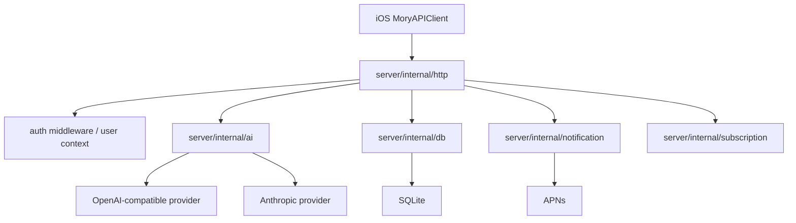
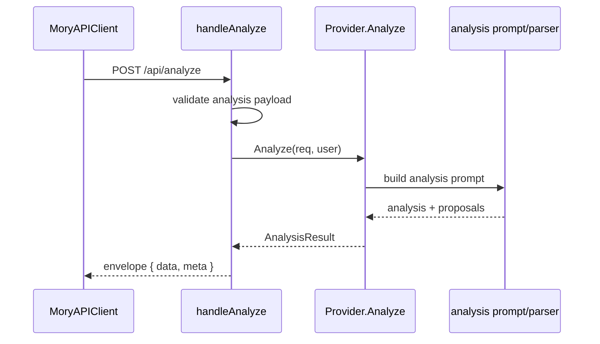

# 08. Server Architecture Audit

本文审计 Go server。范围包括 HTTP handlers、auth、AI providers、Analysis contract、SQLite store、notification push delivery 和 subscription。

## 1. Server 总览

当前模块：

| 模块 | 职责 |
| --- | --- |
| `cmd/server` | 进程入口 |
| `internal/config` | 环境变量和配置 |
| `internal/http` | 路由、request/response envelope、auth context |
| `internal/auth` | Apple auth / JWT |
| `internal/ai` | Analysis、reflection、intelligence providers、prompt、parse |
| `internal/db` | SQLite persistence |
| `internal/notification` | push payload、APNs、delivery worker |
| `internal/subscription` | subscription verify |

## 2. HTTP Layer

职责：

- 提供 `/healthz`、metrics。
- auth apple/refresh。
- canonical Analysis。
- reflection、question、chapter、photo semantic、notification intent。
- push register/enqueue/writeback。
- subscription verify。

问题：

- `handlers.go` 超过 1100 行。
- handler request/response type、route function、helper function 全在同一个文件。

解决方案：

- 拆成：
  - `handlers_auth.go`
  - `handlers_analyze.go`
  - `handlers_reflection.go`
  - `handlers_notification.go`
  - `handlers_push.go`
  - `handlers_subscription.go`
  - `response_envelopes.go`
- Server route registration 可以仍在 `server.go`。

## 3. Auth

职责：

- Apple identity token 校验。
- refresh。
- user context。

问题：

- iOS 侧已增加 refresh 401 后 session expired 处理；server 侧 auth error response 必须保持稳定。

解决方案：

- Auth error envelope 标准化。
- 401 与 403 语义清楚：invalid/expired token -> refresh or logout；forbidden -> capability/account issue。

## 4. Analysis

当前流程：

优点：

- canonical analysis route 已存在。
- request 包含 context pack、mood evidence、client capabilities。
- response 包含 analysis、proposal arrays、quality。

问题：

- `types.go` 同时包含 request/response structs、validation、quality/proposal builders。
- provider files 中 Analysis、Reflection 和其他 intelligence endpoints 仍需要继续保持边界清晰。
- deterministic proposal normalization helper 容易让人误解 proposal 全由 AI 原生生成。

解决方案：

- 拆：
  - `v7_request.go`
  - `v7_response.go`
  - `v7_validate.go`
  - `v7_quality.go`
  - `v7_proposal_builders.go`
- provider 拆 legacy/v7/reflection 文件。
- 文档中明确 deterministic builder 是 fallback/normalization bridge。

## 5. AI Providers

职责：

- OpenAI-compatible endpoint。
- Anthropic endpoint。
- prompt construction。
- response parse。
- usage metadata。

问题：

- `anthropic.go` 和 `openai.go` 文件较大。
- tool response / text response / v7 response parse path 可以继续分离。

解决方案：

- 拆 provider common request builder。
- v7 prompt/parser 独立文件。
- provider-specific transport 与 domain parse 分离。

## 6. SQLite Store

职责：

- push tokens。
- push deliveries。
- delivery events。
- user profiles/onboarding。
- migrations。

问题：

- `sqlite.go` 超过 1100 行。
- migration、scan、CRUD 全在一个文件。

解决方案：

- 拆：
  - `sqlite_store.go`
  - `sqlite_migrations.go`
  - `push_token_store.go`
  - `push_delivery_store.go`
  - `push_delivery_event_store.go`
  - `user_profile_store.go`
  - `scan_helpers.go`

## 7. Notification / Push

职责：

- APNs client。
- push payload。
- delivery worker。
- writeback。

优点：

- notification 模块已经独立。
- push worker 有专门 tests。

问题：

- push delivery worker 较大。
- iOS BGTask/APNs 真机长测仍是 release hardening。

解决方案：

- worker 拆 selection、send、retry/update 三段。
- 将 delivery policy 参数配置化。

## 8. Subscription

职责：

- subscription verify。

当前规模小，可保持。

后续如果加入 App Store transaction 校验、entitlement、server-side account state，应拆成独立 service + store。

## 9. Server 与 iOS 合同边界

稳定合同：

- `/api/analyze` 是新建记忆生产分析主路径；旧 `/api/analyze/v7`、`/api/analysis/records`、`/api/analysis/preview` 不再注册。
- server 返回 proposals，iOS 本地 policy 决定是否 trusted mutation。
- push register/enqueue/writeback 由 iOS notification services 使用。

风险：

- iOS 和 server Analysis structs 分别定义，缺少 schema contract test 生成。

解决方案：

- 增加 shared JSON fixtures。
- iOS `AnalysisContractTests` 和 Go handler/provider tests 使用同一 fixture corpus。

## 10. Server 优先级

| 优先级 | 问题 | 解决方案 |
| --- | --- | --- |
| P0 | Analysis contract drift | 共享 fixtures + contract tests |
| P1 | handlers.go 过大 | 按 route family 拆 |
| P1 | sqlite.go 过大 | 按 store concern 拆 |
| P1 | provider 文件混合 legacy/v7/reflection | provider transport 与 operation 分离 |
| P2 | push worker 继续增长 | 拆 retry/send/update |
