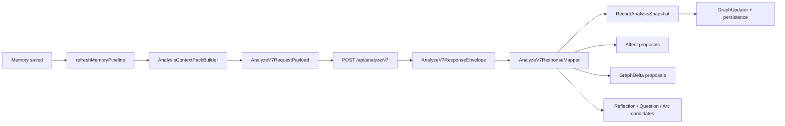

# AI v7 Analyze Feature Inventory

## User Entry

There is no direct user button for normal v7 analysis. It starts after a memory is saved or when a user retries analysis from memory detail/debug.

## Expected User Experience

After saving a memory, Mory should quietly analyze it, then surface useful results: summary, themes, people/places, graph links, reflections, questions, and proposals that need review. Users should know whether analysis is pending, running, complete, failed, or needs review.

## Current UI Visibility

- Memory Detail shows pipeline status, retry, and AI analysis disclosure.
- Timeline/Home can show pipeline status.
- Insights and Debug can expose proposals and context-pack traces.
- There is no single product-level "analysis ready" or "needs review" inbox.

## Data Chain

## Context Inputs

v7 analysis is intended to use:

- current `RecordShell`,
- current `Artifact` list,
- `SelfProfile`,
- known entity/person/place profiles,
- related memories,
- arcs/reflections,
- correction events,
- privacy decisions,
- context budget report.

## Persisted Outputs

| Output | Persistence | User Visibility |
| --- | --- | --- |
| Summary/themes/entities | `RecordAnalysisSnapshotStore` | Detail and search |
| Graph nodes/edges/links | `EntityNodeStore`, `EntityEdgeStore`, `ArtifactEntityLinkStore` | People/Insights/Debug |
| Affect proposals | `AffectSnapshotStore` or proposal mapping | Composer/detail/debug depending source |
| GraphDelta proposals | `GraphDeltaStore` | Insights/Debug review |
| Reflection | `ReflectionSnapshotStore` | Reflections/Detail |
| Arc | `TemporalArcStore` | Arcs/Insights |
| Clarification question | `ClarificationQuestionStore` | Intelligence/question UI |
| Pipeline status | `MemoryPipelineStatusStore` | Detail/Timeline/Home/Debug |

## AI Intervention Points

v7 Analyze is cloud AI and happens after local save. It does not block memory creation. It can create proposals and derived summaries, but it should not directly overwrite user-authored memory text.

## Failure And Retry

- Before call: pipeline status becomes `running`.
- Success: status becomes `completed`, request/response trace can be stored.
- Failure: status becomes `failed` with stage, HTTP status, error, and trace when available.
- Retry: memory detail and debug paths can call `refreshMemoryPipeline`.

## Billing Cut Point

This is the most important server-enforced paid boundary. Free users can receive limited v7 analysis; Pro users can receive larger quotas, deeper context pack retrieval, richer proposal families, and longer history windows.

## Current Status

`usable`

## Gaps And Next Step

1. Add a product-level analysis queue/status surface.
2. Add "analysis ready" and "needs review" transitions.
3. Enforce quota/entitlement on `/api/analyze/v7` before paid launch.
4. Keep proposal-first safety boundaries visible to users.
