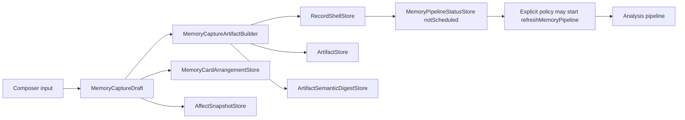

# Capture Feature Inventory

## User Entry

- Global capture composer through the app shell.
- Composer action strip for mood, Journaling, camera, photo picker, audio, link, music, place, todo, and auto context refresh.
- External capture and Journaling can seed the same composer.

## Expected User Experience

The user should be able to collect one memory from multiple inputs, review cards before saving, remove unwanted cards, save once, then let Mory analyze in the background without blocking continued use.

## Current UI Visibility

`UnifiedCaptureComposerView` shows:

- editable body text,
- compact 4-column board preview for staged cards,
- affect cards,
- context cards,
- arrangement size/stack/reorder/delete controls,
- saving spinner,
- local error text.

It does not clearly explain what AI is doing after save.

## Supported Input Types

| Input | Draft Type | Persisted Type | Status |
| --- | --- | --- | --- |
| Body text | `.text` | `ArtifactKind.text` + `RecordShell.rawText` | `stable` |
| Photo | `.photo` | `ArtifactKind.photo` | `usable` |
| Video | `.video` | `ArtifactKind.video` | `wired` |
| Audio | `.audio` | `ArtifactKind.audio` | `wired` |
| Link | `.link` | `ArtifactKind.link` | `usable` |
| Location | `.location` | `ArtifactKind.location` | `usable` |
| Weather | `.weather` | `ArtifactKind.weather` | `usable` |
| Music | `.music` | `ArtifactKind.music` | `usable` |
| Todo | `.todo` | `ArtifactKind.todo` | `usable` |
| Reflection prompt | `.promptAnswer` | `ArtifactKind.document`, `documentType=promptAnswer` | `wired` |
| Person context | `.personContext` | `ArtifactKind.document`, `documentType=personContext` | `wired` |
| Structured mood | `AffectSnapshotDraft` | `AffectSnapshotStore` | `wired` |

## Data Chain

## Persistence Fields

- `RecordShell.captureSource`: broad source such as composer, audio, photo, importFile.
- `RecordShell.rawText`: normalized primary text.
- `RecordShell.userMood`: legacy mood summary.
- `RecordShell.inputContext`: freeform context lines such as Journaling version or source.
- `Artifact.metadata.captureOrigin`: manual, context, imported, inferred.
- `ArtifactSemanticDigest`: media meaning such as OCR, local visual labels, caption, transcript, dimensions, duration, and local identifiers. This is the structured semantic bridge for future analysis.
- `MemoryCardArrangement`: user-authored card layout for composer/detail/today desk. It is visual presentation state and is not part of default AI analysis input. Current layout policy uses a fixed 4-column logical grid with size tokens (`stamp`, `strip`, `card`) and per-node `gridPlacement(column,row)`.
- `MemoryCardObjectMetrics`: derived render-time sizing for recipe + size + density. It is not persisted and does not change the fact model.
- `AffectSnapshot.sources`: userSelected, journalSuggestionStateOfMind, aiInferredText, userCorrected, and related sources.

## AI Intervention Points

| Point | AI/Processing | Blocking | User-Visible |
| --- | --- | --- | --- |
| Photo add | Local `PhotoArtifactProcessor` OCR/summary/thumbnail | Blocks photo card creation briefly | Processing card |
| Voice seed | Cloud transcript refinement after composer opens | Does not block save explicitly | Refining card |
| Save | No cloud AI before local save | Save waits for local persistence | Save spinner |
| After save | Analysis runs in background task spawned by app process | Does not block save | Pipeline status later |

## Failure And Retry

- Save failure stays in composer as error text.
- Post-save analysis failure is stored in `MemoryPipelineStatusStore.failed`.
- Memory detail has retry support.
- User is not proactively guided to failed analysis after leaving composer.

## Billing Cut Point

Potential future gates:

- Free: local capture and basic local metadata.
- Pro: deeper Analysis, full-history context pack, reflection, advanced people graph.
- Server must enforce AI quota; client gates are only UX.

## Current Status

`usable`

## Gaps And Next Step

1. Add a product-level "analysis running / ready / failed" status flow after save.
2. Prevent transcript refinement from overwriting user-edited text.
3. Add stronger provenance fields for imported and Journaling-originated cards.
4. Continue product polish for video, prompt, person, affect, and drag/reorder card interactions after Debug acceptance.
