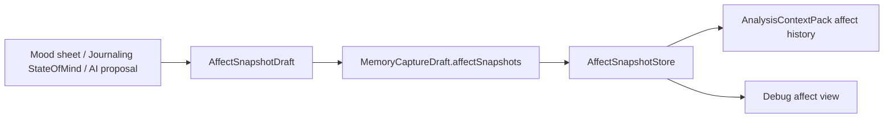

# Mood And Affect Feature Inventory

## User Entry

- Mood button in the capture composer.
- Apple Journaling Suggestions `StateOfMind`.
- AI v7 affect proposals after analysis.
- User corrections from affect review/debug flows.

## Expected User Experience

Mood should be quick to enter, visible as evidence, correctable later, and safe for long-term personalization. It should distinguish user-selected mood from AI inference and system-provided StateOfMind.

## Current UI Visibility

- Composer shows affect cards for selected/imported mood evidence.
- Debug Affect Snapshot view lists snapshots, sources, vectors, labels, tone hints, confidence, and evidence.
- Product-level affect history and correction experience are incomplete.

## Data Chain

## Fields

`AffectSnapshot` includes:

- valence,
- arousal,
- dominance,
- intensity,
- labels,
- tone hints,
- appraisal,
- sources,
- confidence,
- evidence metadata,
- userConfirmed,
- needsUserCheck,
- rawInput.

StateOfMind source only supplies official fields: labels, associations, valence, valenceClassification, and kind. Mory does not fabricate arousal/dominance for that source.

## AI Intervention Points

- User-selected mood does not require AI.
- Journaling StateOfMind is user-authorized system evidence, not AI inference.
- v7 Analyze can return affect proposals after save.
- User correction should become evidence for future analysis.

## Billing Cut Point

Manual mood should remain free. Long-term affect trend analysis, deep reflection, and full-history pattern detection can be Pro-gated.

## Current Status

`wired`

## Gaps And Next Step

1. Productize affect history and correction.
2. Preserve import session provenance for StateOfMind.
3. Add clear UI distinction: user-selected, system StateOfMind, AI-inferred, user-corrected.
