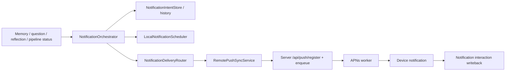

# Notifications And Background Feature Inventory

## User Entry

- Notification settings.
- Permission settings.
- Local notification delivery.
- Remote push registration and diagnostics.
- Daily question and intelligence recovery services.

## Expected User Experience

Mory should remind users only when there is useful context: daily question, analysis ready, reflection ready, or explicit debug/manual routing. Stage-forming, repeated-theme, and revisit signals can exist in-app, but should not proactively push by default. Users should know why a notification arrived and where it will open.

## Current Components

| Component | Purpose | Status |
| --- | --- | --- |
| `NotificationOrchestrator` | Single entry for trigger -> dedupe -> policy -> local/remote delivery | `usable` |
| `LocalNotificationScheduler` | Schedule local notifications | `usable` |
| `RemotePushSyncService` | Register/sync APNs token and preferences | `wired` |
| `NotificationDeliveryRouter` | Route delivery/interactions | `wired` |
| `BackgroundTaskCoordinator` | Register/run BGTask handlers | `wired` |
| Server push endpoints | Register/enqueue/writeback | `wired` |
| APNs worker | Deliver queued remote pushes | `wired` |

## Data Chain

## AI Intervention Points

- Daily question generation calls `/api/intelligence/suggest-questions`.
- Chapter suggestion can call `/api/intelligence/suggest-chapters`.
- Notification scheduling itself is policy logic, not AI.

## Failure And Retry

- Local notifications depend on user permission and scheduler state.
- Remote pushes depend on APNs token registration, server queue, worker, and writeback.
- Debug Remote Push Diagnostics and Settings/Memory Intelligence expose notification history and routing state.
- Real-device timing and BGTask scheduling remain validation gaps.

## Billing Cut Point

Basic reminders should be free. AI-generated timing, deep context reminders, and long-term reflection notifications can be Pro-gated by server-side quota and entitlement.

## Current Status

`usable`

## Gaps And Next Step

1. Complete real-device APNs and BGTask validation matrix.
2. Remove legacy notification enums/toggles that no longer map to proactive delivery.
3. Add release-ready notification copy and explanation polish.
