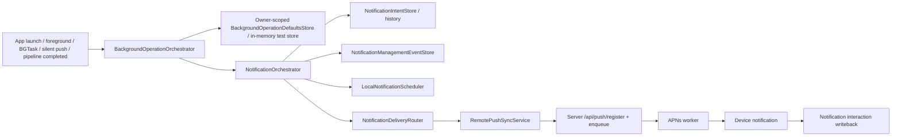

# Notifications And Background Feature Inventory

## User Entry

- Notification settings.
- Permission settings.
- Local notification delivery.
- Remote push registration and diagnostics.
- Daily question and intelligence recovery services.

## Expected User Experience

Mory should remind users only when there is useful context: daily question, analysis ready, reflection ready, or explicit debug/manual routing. Former stage/repeated/revisit push concepts are no longer part of `NotificationIntent`, APNs registration, or Notification Management; similar long-term patterns can surface inside Home/Insights cards only. Users should know why a notification arrived and where it will open.

## Current Components

| Component | Purpose | Status |
| --- | --- | --- |
| `NotificationOrchestrator` | Single entry for trigger -> dedupe -> policy -> local/remote delivery | `usable` |
| `NotificationManagementView` | Single Settings/Debug surface for queue, history, dedupe, errors, and preferences | `usable` |
| `NotificationManagementEventStore` | Persistent notification management log for dedupe, policy block, delivery, route, and interaction events | `usable` |
| `BackgroundOperationOrchestrator` | Shared trigger entry for app launch, foreground, BGTask, silent push, pipeline-completed, APNs token, and URLSession callbacks before notification orchestration | `usable` |
| `BackgroundManagementView` | Debug/Settings surface for background runs, operation events, jobs, pipeline statuses, and push state | `usable` |
| `LocalNotificationScheduler` | Schedule local notifications | `usable` |
| `RemotePushSyncService` | Register/sync APNs token and preferences | `wired` |
| `NotificationDeliveryRouter` | Route delivery/interactions | `wired` |
| `BackgroundTaskCoordinator` | Register/run BGTask handlers | `wired` |
| Server push endpoints | Register/enqueue/writeback | `wired` |
| APNs worker | Deliver queued remote pushes | `wired` |

## Data Chain

## AI Intervention Points

- Daily question generation calls `/api/intelligence/suggest-questions`.
- Chapter suggestion can call `/api/intelligence/suggest-chapters`.
- Notification scheduling itself is policy logic, not AI.

## Failure And Retry

- Local notifications depend on user permission and scheduler state.
- Remote pushes depend on APNs token registration, server queue, worker, and writeback.
- `Notification Management` is the single reachable status page from Settings and Debug. It shows:
  - Queue: `pending`, `scheduled`, `inAppOnly`, `blocked`.
  - History: `delivered`, `opened`, `dismissed`.
  - Dedupe: dedupe key hits and source trigger.
  - Errors: policy block, delivery error, route error.
- Local/APNs actions on that page call the formal orchestrator and push sync services. They do not create side-channel intents.
- App launch, scene foreground, APNs token changes, notification preference changes, BGTask callbacks, silent push, background URLSession, and pipeline completion now enter `BackgroundOperationOrchestrator` first. Notification generation still happens only through `NotificationOrchestrator`.
- Background operation logs are diagnostic state, not memory facts: they are stored in an owner-scoped JSON/UserDefaults store with an in-memory test fallback, so early app startup does not mutate the SwiftData memory schema.
- Real-device timing and BGTask scheduling remain validation gaps.

## Current User-Visible Entry

- Settings -> Notifications opens `NotificationManagementView`.
- Debug -> Notification Management opens the same view.
- Memory Intelligence no longer has a separate Notification History page.
- Remote Push and Notification Background debug pages are no longer product/debug entry points.

## Billing Cut Point

Basic reminders should be free. AI-generated timing, deep context reminders, and long-term reflection notifications can be Pro-gated by server-side quota and entitlement.

## Current Status

`stable`

## Gaps And Next Step

1. Complete real-device APNs and BGTask validation matrix.
2. Harden `BackgroundOperationOrchestrator` beyond the usable baseline: retry policy, quota, cancellation, and product-readable status still need work.
3. Add release-ready notification copy and explanation polish.
