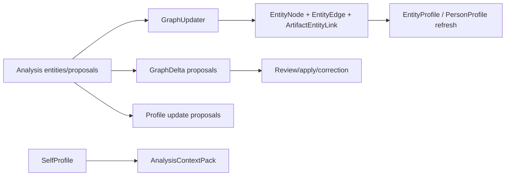

# People, Self, And Graph Feature Inventory

## User Entry

- People screen.
- Person detail and profile edit screens.
- Person merge/split screen.
- Settings / Memory Intelligence GraphDelta review.
- Debug Person Profile and Analysis Context Pack views.

## Expected User Experience

Users should understand who Mory thinks each person is, what evidence supports that profile, how "me" is represented, and how to correct wrong merges, relationships, or portraits.

## Current Model Layers

| Layer | Purpose | Status |
| --- | --- | --- |
| `SelfProfile` | User's own long-term profile and personalization center | `wired` |
| `EntityNode` | Basic graph node for person/place/theme/decision/activity/object | `usable` |
| `EntityProfile` | Generic lightweight intelligence profile | `usable` |
| `PersonProfile` | Rich person-specific relationship/portrait profile | `wired` |
| `PlaceProfile` | Place-specific profile | `usable` |
| `CorrectionEvent` | User correction ledger | `wired` |
| `GraphDelta` | AI/local proposal staging | `wired` |
| `EntityTombstone` | Merge/delete replacement record | `wired` |

## Data Chain

## Self Profile

`SelfProfile` is separate from normal people. It has its own store and fields for display name, aliases, pronouns, life roles, goals, preferences, sensitive boundaries, important relationships, common places/themes, expression patterns, and privacy mode.

It has `selfEntityID`, but it should not be treated as a normal person that can be casually merged.

## AI Intervention Points

- Analysis extracts entity mentions and proposals.
- Entity resolution and graph update create/merge candidate nodes.
- Person profile refresh can generate portraits and relationship summaries.
- Context pack uses SelfProfile and known profiles before Analyze.

## Billing Cut Point

Basic people list can be free. Rich portraits, relationship history, full graph, long-term changes, and full-history context pack are likely Pro features.

## Current Status

`wired`

## Gaps And Next Step

1. Add product-facing My Profile surface.
2. Add evidence viewer for each person/profile field.
3. Complete reject/undo/reason UX for GraphDelta and merge/split.
4. Keep contact import as person context until review confirms entity identity.
