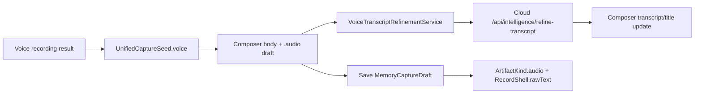

# Voice And Audio Feature Inventory

## User Entry

- Voice quick capture seed.
- Composer audio sheet.
- Imported audio-like artifacts can become audio cards when available.

## Expected User Experience

The user records audio, sees the transcript and audio card, can edit text immediately, and Mory may improve punctuation/title without taking control away.

## Current UI Visibility

- Composer shows audio cards.
- A transcript refinement loading item can appear.
- Debug Cloud Intelligence can run transcript refinement.

## Data Chain

## AI Intervention Points

| Point | AI | Blocking | Current Risk |
| --- | --- | --- | --- |
| During recording | None in current app code | No | No live tone analysis. |
| After recording enters composer | Cloud transcript refinement | No explicit block | AI return can replace text after user edits. |
| After memory save | Analysis | No | Status not strongly surfaced. |

## Persistence

- Audio artifact stores media payload, metadata `transcriptionText`, and `captureOrigin`.
- `RecordShell.rawText` uses body/transcript summary.
- Analysis consumes audio transcript text via artifact text content.

## Failure And Retry

- Transcript refinement errors are swallowed in composer.
- Audio save can still proceed without refinement.
- There is no user-facing "refinement failed" state.

## Billing Cut Point

Recording and local transcript storage should remain free. Cloud transcript refinement and deep semantic analysis can be quota-gated.

## Current Status

`wired`

## Gaps And Next Step

1. Add user-edit guard before applying cloud transcript refinement.
2. Show non-blocking refinement success/failure status.
3. Add tone confirmation UX after voice only when it does not slow capture.
