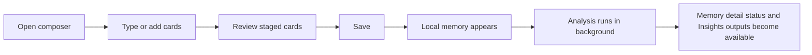
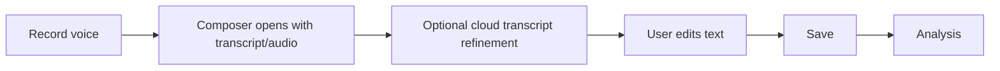
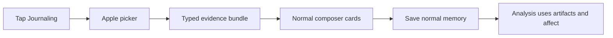
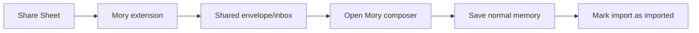
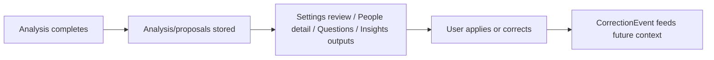

# User Journeys

This section describes what the user expects to happen from start to finish. These flows are product-facing; implementation details live in the data and AI matrices.

## Journey: Normal New Memory

Current state: the memory appears after local save, but analysis status is not presented as a coherent user journey.

## Journey: Voice Memory

Current risk: transcript refinement can apply after the user starts editing.

## Journey: Journaling Suggestion

Current risk: imported evidence is visible as cards, but original bundle/session provenance is not fully user-visible.

## Journey: Share To Mory

Current risk: if handoff fails, recovery exists but the user may not understand where the content went.

## Journey: AI Review And Correction

Current risk: apply path exists, but reject reason, undo, and evidence explanations are incomplete.
