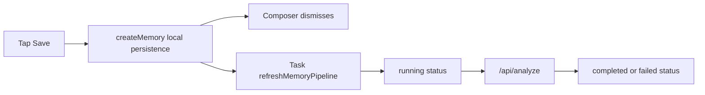

# AI Intervention Matrix

This section records exactly where AI or intelligent processing participates, whether it blocks the user, and how failure is surfaced.

## Matrix

| Feature Moment | Service | Local Or Cloud | Blocks User | Can Overwrite User Input | Visible Status | Failure Surface |
| --- | --- | --- | --- | --- | --- | --- |
| Add photo | `PhotoArtifactProcessor` | Local | Briefly blocks card creation | No | Processing card | Composer error |
| Add link metadata | `LinkMetadataExtractor` | Local system framework/network metadata | Blocks link sheet action while loading | No | Link sheet progress | Link sheet result/error |
| Add auto context | `ContextAutoCollector` | Local/system services | Does not block editing | No | Context collecting card | Missing context mostly silent/diagnostic |
| Voice transcript refinement | `VoiceTranscriptRefinementService` | Cloud | No explicit block | Yes, current risk | Refining card | Error swallowed |
| Save memory | `MemoryCreationUseCase` | Local | Yes, short local save | No | Save spinner | Composer error |
| Post-save analysis | `AnalysisExecutor` | Cloud Analysis | No | No direct text overwrite | Pipeline status | Detail/status/debug |
| Daily question | `DailyQuestionSuggestionService` | Cloud | Background/user initiated | No | Question card/notification | Debug/log/status |
| Reflection generate/replay | Reflection endpoints | Cloud | Usually user/background initiated | No | Reflection view/debug | Error status/debug |
| Notification orchestration | `NotificationOrchestrator` | Local + optional cloud routing | Background | No | Notification history/debug | Orchestration report + delivery/debug |
| Job worker recovery | `IntelligenceJobWorker` | Local + cloud | Background | No | Debug job queue | Job failure state |

## Detailed Notes

### Photo Import

Photo processing is local. It creates thumbnail, OCR, summary, and metadata before the card appears. Cloud Analyze sees the resulting artifact only after the memory is saved.

### Voice Refinement

Cloud transcript refinement occurs after the voice seed enters the composer. It updates body text, title, and audio artifact transcript. Current implementation does not visibly protect against user edits made while the request is in flight.

### Save And Analyze

Save is local-first:

The user can continue after save. The risk is not blocking; the risk is weak status communication.

### Background Timing

Post-save analysis currently starts from an app-process `Task`. BGTask and recovery services exist, but iOS does not guarantee unlimited background execution. If the app is killed, recovery/background orchestration must handle pending jobs; real-device validation remains necessary.

## Required Product Rule

Any AI feature must state:

- before-save or after-save,
- local or cloud,
- blocking or non-blocking,
- whether it can mutate user-visible draft text,
- where status appears,
- how user retries or corrects it.
