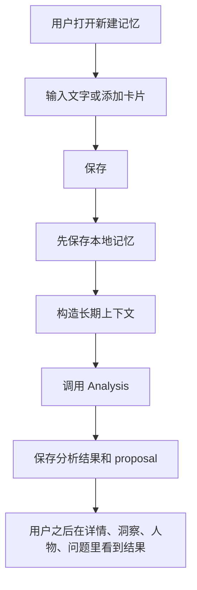
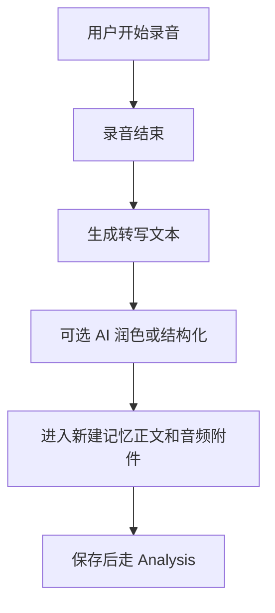
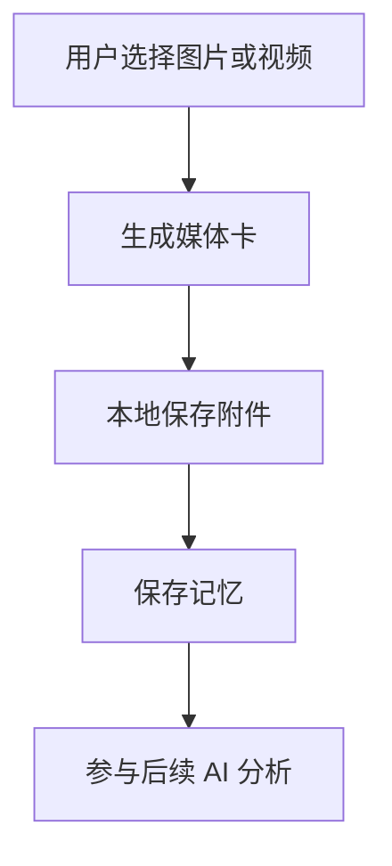
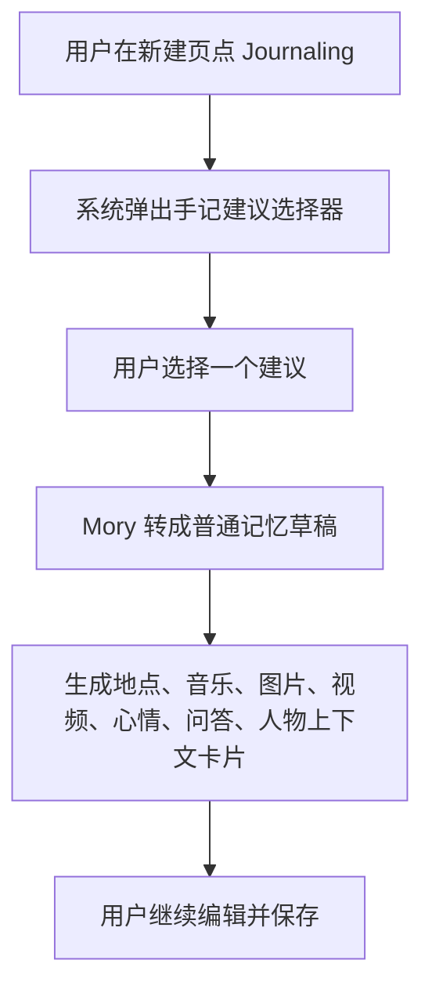
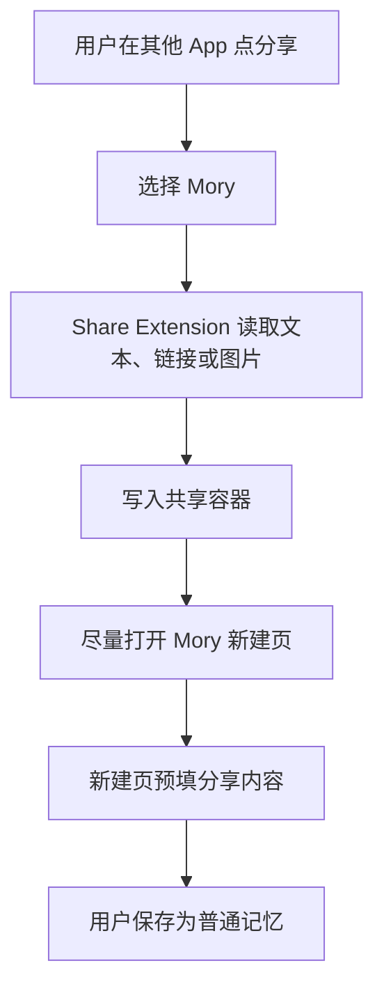
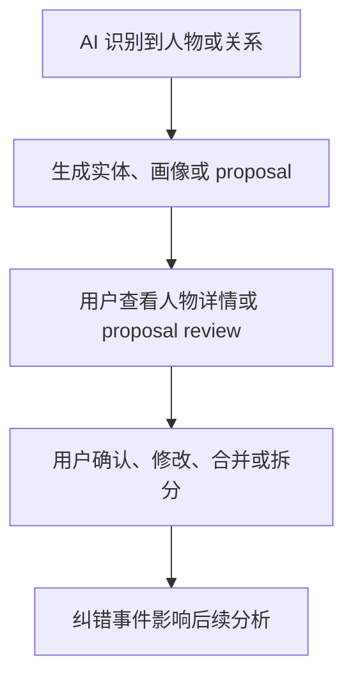
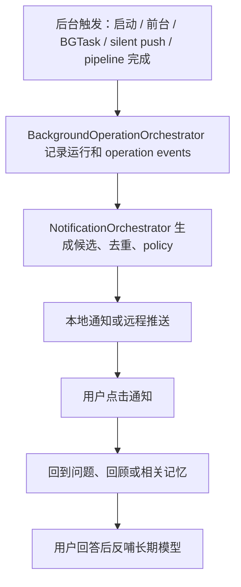

# 用户旅程

这一页按用户动作解释 Mory 会发生什么。

## 普通新建记忆

用户体验重点：

- 用户点击保存后，不应该被 AI 分析挡住。
- AI 失败不应该让已保存的记忆消失。
- 用户应该能看到“正在分析、分析完成、分析失败、需要确认”这类状态。

当前差距：

- 保存后分析状态还不够明显。
- 分析失败后的用户动作不够清楚。

## 语音记录

用户体验重点：

- 原始音频、转写文本、AI 润色文本应该能区分。
- 如果用户已经手动改了文字，后到的 AI 结果不应该静默覆盖。

当前差距：

- 需要编辑保护或差异确认。

## 图片和视频记录

用户体验重点：

- 图片/视频是记忆内容，不只是装饰。
- 用户需要知道哪些分析来自图片，哪些来自文字。

当前差距：

- 视频展示和理解还不完整。
- 图片证据来源在产品里还不够清楚。

## Apple Journaling Suggestions

用户体验重点：

- Journaling Suggestions 不是单独的记忆类型。
- 它应该像“系统帮你带来一组上下文”，最后仍然进入普通新建页。
- StateOfMind 是高可信心情证据，但不应该伪造系统没有提供的字段。

当前差距：

- 多首歌、活动、事件海报等复杂建议还需要真机验收。
- 多次导入同一个或不同 suggestion 时，来源追踪需要更明显。

## Share 到 Mory

用户体验重点：

- 用户预期是进入 Mory 的新建记忆页，而不是只在后台存一个 Inbox。
- Inbox 应该是失败恢复路径，不是主要体验。

当前差距：

- 真机上不同来源 App 的分享行为还需要持续测试。
- 如果跳转失败，用户需要清楚知道内容没有丢。

## 人物纠错

用户体验重点：

- “我”、朋友、同名人、室友这类实体必须能纠错。
- AI 不应该自动把高风险人物合并变成事实。

当前差距：

- “我的档案”还需要更清晰的正式入口。
- 人物画像证据需要让用户看得懂。

## 通知回访

用户体验重点：

- 通知不应该只是提醒打开 App，而应该带用户回到一个明确任务。
- 用户回答问题后，Mory 应该记住这次修正。
- 通知生成只能从 `NotificationOrchestrator` 出来；后台只负责决定何时触发、执行哪些 operation、记录运行。
- 后台日志是诊断/运行状态，不是记忆事实；它存入 owner-scoped JSON/UserDefaults，而不是 SwiftData 记忆 schema。

当前差距：

- 通知节奏和真机可靠性还需要长期验证。
- 后台域已经有统一入口、日志和 Debug/Settings 页面，但重试、取消、配额、长期状态解释还未产品化。
