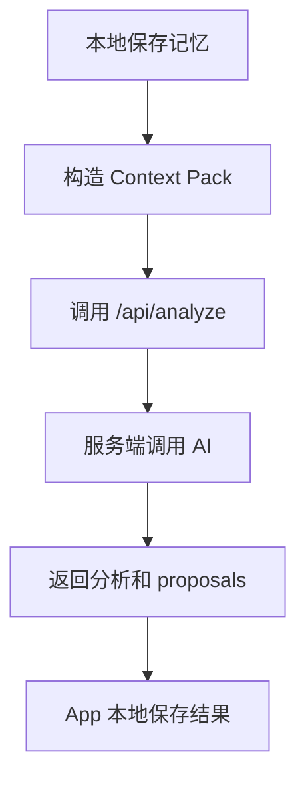

# 数据库和服务端用来干什么

这一页解释“为什么 Mory 需要本地数据库和服务端”，不展开所有字段细节。

## 本地数据库保存什么

Mory 是本地优先的应用。用户保存的核心记忆、附件索引、人物、心情、问题和 AI proposal 都需要先落在本地。

本地保存的内容包括：

- 记忆正文和时间。
- 附件和上下文。
- 分析状态。
- 人物、地点、主题等实体。
- 用户自己的 Self Profile。
- 人物画像 Person Profile。
- 情绪快照 Affect Snapshot。
- GraphDelta proposal。
- Clarification Question。
- Arc 和 Reflection。
- 外部分享和手记建议的导入痕迹。
- 通知 intent 和本地调度状态。

## 服务端保存什么

服务端主要负责这些事情：

- 登录和鉴权。
- 接收 Analysis 请求。
- 调用 AI provider。
- 返回结构化分析和 proposal。
- 管理 push token 和远程通知。
- 保存订阅、用户 profile、评估或 debug 相关数据。

服务端不应该成为用户所有私密记忆的永久唯一来源。Mory 的方向仍然是本地优先，云端只拿完成任务所需的最小上下文。

## API 大概怎么调用

用户保存记忆后，App 会调用分析 API：

其他 API 还包括：

- 登录、刷新 token、Apple 登录。
- 推送 token 注册。
- 通知 intent 上报。
- 订阅状态验证。
- 评估和 debug endpoint。

## 401 登录过期应该怎样处理

用户不应该只在“分析失败”时才知道登录过期，也不应该需要自己退出再登录。

正确体验应该是：

1. App 发现请求返回 401。
2. 尝试刷新 token。
3. 刷新成功则继续请求。
4. 刷新失败则清理登录状态。
5. UI 自动回到登录页，并说明 session expired。

这条链路已经有基础，但需要持续在真机和服务端错误场景下验证。

## 删除和隐私影响

未来上线前必须明确：

- 删除一条记忆时，相关附件、分析、图谱边、心情、proposal 是否一起删除。
- 删除一个人物时，画像、关系、Arc、Reflection 里的引用怎样处理。
- 删除 Self Profile 或敏感字段时，云端是否保留过上下文片段。
- 用户导出数据时，哪些字段要包含，哪些是系统内部诊断。

这些问题不仅是技术问题，也会影响隐私说明和用户信任。

## 为什么现在需要数据库目录

随着功能增多，不能只说“数据存在本地”。我们需要知道：

- 哪个功能写入哪些表或 store。
- 哪个字段来自用户，哪个来自 AI。
- 哪个字段可以被用户修改。
- 哪个字段影响后续分析。
- 哪个字段将来可能成为付费功能或额度统计。

这就是技术版 `06_database_catalog` 存在的原因。
